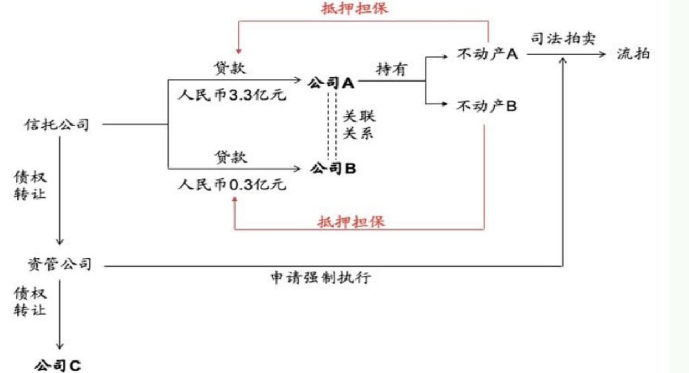
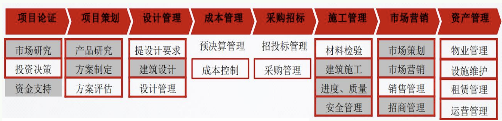
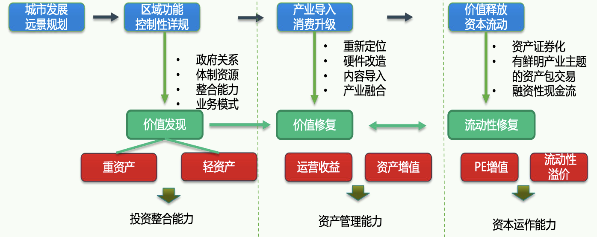
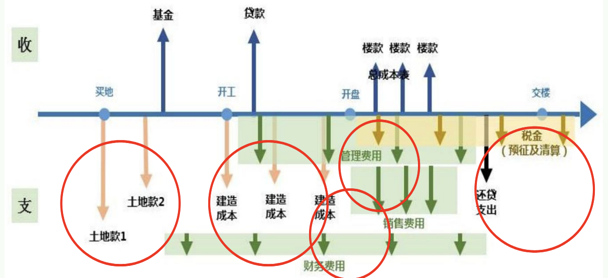
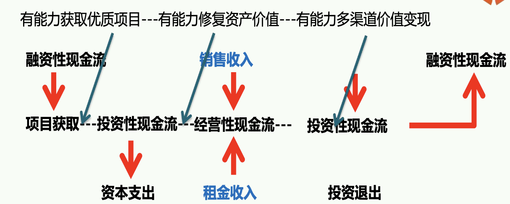
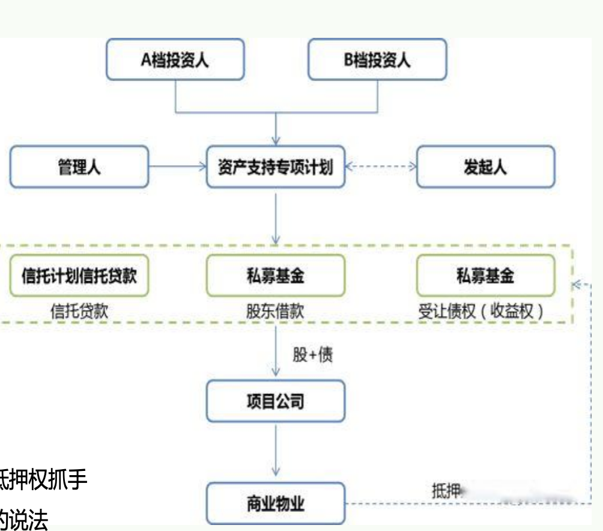
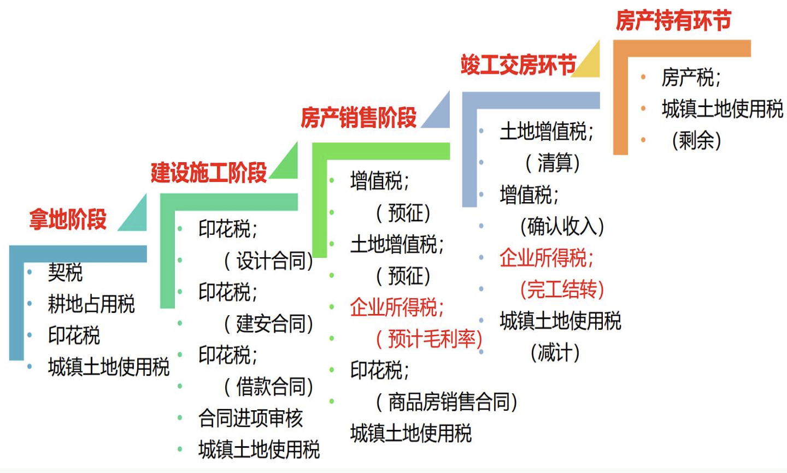
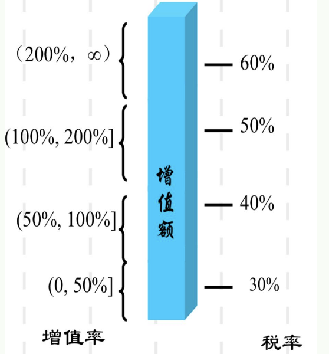
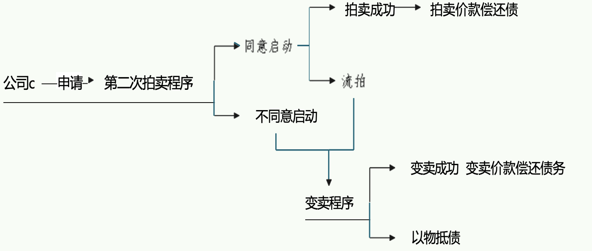

# 解释

不良资产指不符合安全性、流动性、效益性原则，处于逾期、呆滞、呆账状态而面临风险的次级、可疑和损失的银行信贷资产。因其不能给银行带来正常利息收入甚至难以收回贷款本金，给银行带来资产损失并形成一定坏账，在金融体系非良好运营的外围逐步形成潜在金融风险，一直成为国家和金融机构关注的核心。

## 传统收购处置

拆包分解
出租或者出售；自己经营；委托清收；杠杆质押；从而获得处置收益

## 困境企业重组 (整合收益)

在详细的尽职调查的基础上,选取有阶段性还款困难但尚有核心资产的困境企业,提取出有较大升值空间的生产要素,采用资产重整或债务重整等综合手段,获得增值运作收益。这种业务模式处置周期较长,方案较为个性化,时间和协调成本相对较高。

## 不良资产证券化 

资产证券化,是以基础资产未来所产生的现金流为偿付支持, 通过结构化设计进行信用增级, 在此基础上发行资产支持证券 (ABS)的过程。ABS以特定资产组合或特定现金流为支持,发行可交易证券,在场内或者场外进行交易。

## 折扣收益

抵押物多为房屋、厂房、商铺等;抵押率一般在30%~70%之间,50%居多;并且银行的信用高,不良资产的产生与处置都比较规范,整体质量较好。

对于处置公司来说,收回来的主要是债权或抵押物。对于债权方来说,这笔债权我两折买回来了,我去跟债务人谈判,你全额还不起,那你就还五成吧,还了五成那我就给你解除债务关系。这样债务人少还了一半的钱,赚了;资产管理公司两成的成本买回来,收回来五成,赚了三成。

# 涉房地产类不良资产是如何形成的

# 房地产不良形成的原因

项目自身存在问题:
- 违规、违建、超建
- 权属纠纷
- 开发商项目开发能力欠缺
  - 定位不合理
  - 户型设计不合理
  - 定价销售不当

股东或实控人出现问题:
- 股东内耗
- 侵占、挪用项目资金
- 受外部事件牵涉
- 重疾、失踪、身故、 内斗

政策因素:
- 产业政策调整
- 地区规划调整
- 金融政策调整

债务原因:
- 资金链断裂
- 债务结构不合理
- 诉讼案件缠身

不可控因素:
- 市场不景气
- 小业主闹事涉及维稳
- 项目出现特大安全事故
- 项目地块出现文物、水资源保护、防洪、地址水文变化等

# AMC的专业优势

## 不良资产的获取与鉴别能力

- 出色的尽职调查能力通过审慎的尽调, 能够全面衡量资产的信用风险和价值 , 有效识别具有优质债务主体或可靠的抵质押物和其他担保措施的债权资产 
- 领先的资产定价能力通过大量的不良资产处置案例, 积累了不良债权估值和定价的先进经验
- 优异的交易结构设计能力针对不同的债权资产和债务主体, 灵活搭配收购、债务重组 、债权和股权组合投资等交易方式 

## 不良资产运营能力

- 对抵质押物实施精细化管理对债务人和保证人的 日常经营持续密切监控房地产抵押物动态估值, 对运营期债权项目的估值定期跟踪。
- 利用多元业务平台, 提供定制化的产品和服务, 提升债务人的经营能力和偿债能力

## 不良资产处置能力

对地方司法体系、社会环境和资本市场运作有深入了解, 有丰富的处置手段, 包括本息清收、诉讼追偿、债务重组、以资抵债 、资产置换 、债转股 股权回购、资产租赁 、追加投资 、资产上市等可根据债务主体和债权资同特性，设置相应的处置方案；实现项目价值的最大化。

# AMC对不良资产的收购重组方式

债务重组
对于出现短期流动性问题的项目可用债务重组方式立足对债务人长期偿债能力的把握, 通过更改债务条款或实施债务合并, 使债务人的还款能力与调整后的各项要素条件匹配, 化解企业流动性风险。

资产整合
对于债务人经营不善, 负债结构复杂, 但具有较大增值潜力核心资产的项目,可以采用资产整合方式。通过重组, 清理债权债务、整合债权, 使债务人的核心资产能够重新开始建设、运营, 并通过追加投资、参与运营等方式, 提升资产价值。

企业重组
对于资金链断裂、企业陷入困境, 但仍具有持续经营价值的债务人,可以选择企业重组方式。通过债务重组、追加投资, 辅以资产整合,挖掘企业土地的经济价值,帮助债务人改善生产经营, 产生稳定现金流清偿债务

# AMC与大型地产开发商协作

房企优势：
开发能力强
周转速度高
市场布局广泛
产品标准化
品牌溢价高

AMC优势：
资金雄厚
资本运作经验丰富
风险控制能力强与政府
部门沟通效率高
资源整合能力强

# 受让债权+资产推拍

核心: 通过受让优先债权, 在法拍中掌握一定主动权。

特点简析：
- 主要针对资不抵债类项目, 即债权实际受损, 无法进行债务重组
- 重组方主要瞄准资产潜在升值潜力 , 而非只想赚受让债权得到足额清偿后的差价;
- 涉及多方债权人, 优先考虑收购所有债权, 以加强对诉讼进度把控;
- 项目整体诉讼流程时间较长, 大概率事件会面临债务人利用司法手段进行抗辩诉讼的情况;
- 资产法拍后, 债权受偿顺序讲究多, 可能导致部分债权无法足额受偿;
- 重组方通过受让债权, 虽然取得优先债权人地位, 但在债权转物权, 推拍拿资产过程中均存在较大的不确定性。
- 资不抵债的情况下, 债务人主动申请或者被申请破产可能性较大, 债权清偿程度和清偿周期均存在一定的不确定性

# 债务重组+盘活资产

核心: 注入流动性, 以盘活资产

特点解析 重组方利用其主体优势，对原债权人可选择保留或者替换：
- 主要适用于资产价值尚大于所有负债的困境地产项目
- 考虑到原股东 (债务人) 丧失或无符合要求的管理运营能力, 从而重组方接手项目管理运营权, 注入管理运营能力
- 重组方对项 目注入部分资金, 以弥补项 目资金缺口
- 常规通过股权交易或资产交易获取项 目控制权, 具体要做交易结构和税务筹划安排

# 债务重组+房产代建

## 重组基金

债务清偿：
- 金融债券: 承接银行、信托债权（取得抵押权）
- 非金融债券：缓解、安抚（小额现金、后期以房抵债）

建设销售：
- 代建待开发：达到可预售状态
- 资金回流：资产快速去化、销售回款解除查封

## 债务重组方案
- 金融债权: 以较低价格承接债权, 并取得 目标物业抵押权。保证即使通过司法强拍亦能安全退出。
- 非金融债权: 达成还款计划 , 以较少资金, 缓解债权人情绪, 取得债务折扣率, 化解查封危机。

## 建设销售

- 加快回款: 通过前期还款协议, 并以较少资金, 实现部分已建成房产解封,实现销售回款; 回款资金, 化解其他查封, 实现滚动开发。
- 代建代开发: 未开发部分引入开发商代建代开发, 达到可预售状态, 实现销售收入

## 相关政策

### 2021年北京城市更新行动指导意见

综合整治：民生、基础设施、公共空间
老旧小区/危旧楼房改建/核心区平房院落：可增容、配套、停车、电梯、保障性租赁住房
老旧厂房：产业准入、产业短板/高端制造
工业用地/产业园：产业转型升级、腾笼换鸟用途混合、鼓励地下空间复合利用
其他类型：公共空间、传统商圈、街区

### 2015年之后上海一系列的城市更新办法/细则

民生、政府主导

1.持有比例: 一般区域商业不低于80%、办公不低于40%, 不低于 10 年。最小可售单位是层。
2.非宅地不得转为住宅,但可转为租赁住房。商业与商办可以互转, 住宅可转为商业/商办。
3.公共空间的容积率奖励,不同地块之间的平衡转移。
4.拆除重建（重新计期）、改扩建（用途不变的，延用; 用途改变的, 可续新)
5.参考剩余年限、基准地价, 差额补缴地价

## 业务解析：城市更新比传统地产业务的个性化更强

### 制造业要素 VS 房地产要素

- 研发：研策、定位、设计
- 许可：土地、规划、验收
- 生产：营造、施工、统筹
- 服务：营销、商管、物管

### 需要关注的核心痛点

- 全过程的政府监督介入：边界条件
- 可逆性普遍比较差：前期决定论
- 标准化不强：一事一议居多
- 运营门槛的影响特别大：业态差异

## 业务解析：参与城市更新所需要的核心能力

行业的关键词永远是资源、资产、资本
结合自身的资源禀赋，找到合适的领域类型
如何解决自身能力的短板问题
分段负责、整合外包、搭配拼盘、贴牌

## 业务解析：更新的实质是在最佳用途vs约束之间寻找平衡

1. 重新定位
  - 对项目所处区域的整体规划、发展趋势进行研判
  - 对项目周边人口特征、竞品项目特征进行综合分析研判
2. 约束研判
  - 政策限制
  - 项目现有硬件条件的优劣势
  - 项目现有经营内容与市场需求之间的差异
  - 与拟导入的产业/业态的软硬件要求之间的差异
3. 硬件提升
  - 结合项目定位和业态导入规划，对建筑空间改造提升，满足使用需求
  - 注重公共空间和社区融合，符合城市发展规划的新理念
4. 内容导入
  - 以产业导入为内核，辅以适配的服务内容，落实项目定位
  - 在租金、租期、面积等多种要素中取得平衡，确保项目坪效提升可操作性

## 业务解析：城市更新的表层是产品力问题，底层是现金流问题

合理使用杠杆（LTV）：前融、借款、垫资、并购贷、开发贷、经营贷
优化现金流（早进晚出FILO）：土地款/并购款分期或拖延、拖延付款、关联方往来款、预售/预订、预租/预收/押金

> 核心是与经营匹配

## 更新盘活思路：实质是现金流的修复和变现

有能力获取优质项目---有能力修复资产价值---有能力多渠道价值变现

城市更新的价值来自现金流
三类现金流协同
现金流的时间分布
价值变现的速度

设计盘活交易中需要关注的三个要点（理想状态vs约束条件）：
- 项目的最佳商业用途是什么？多大程度可以实现？
- 项目的现金流卡在哪里？多大程度可以调节/优化？
- 股债资本结构是否与项目现金流匹配？安全垫多大？

## 约束条件梳理：识别&应对是交易设计的核心考量基础

### 能否具体实现的影响因素

原业主
原股东
债权人
合作方
租户
小业主
施工方
政府
税务
其他

### 现金流影响因素

现金流来源:
- 引入何种业态
  - 影响未来收益
  - 受制于项目规划
- 是否可以销售
  - 受制于项目规划
  - 有利于现金流
- 业态是否迎合资本
  - 影响项目退出
  - 影响项目估值

流入时点:
- 销售现金流的排布: 渠道和税筹能力
- 租赁现金流的排布: 招商去化能力
- 现状是否可以运营: 尤其是烂尾项目

流出时点:
- 获取项目的支付
  - 是否存在交易风险
  - 是否获得应有的权益
  - 是否保持足够的制约
  - 是否对自身形成保护
- 是否需要改造，多少时间
- 运营成本和支出
  - 外包服务
  - 自有团队
- 是否有期间派息安排
  - 受股债安排影响
  - 与项目属性相关

### 需要关注的边界约束

项目规划立地条件
项目后续运营所需
项目权属与交易对手
项目相关资本结构

# 资产层面：权属状况与规划边界

权属证明：土地出让公告、出让须知、成交确认书、出让合同、政府交地协议、土地出让金缴纳凭证、契税缴纳凭证、国有土地使用证/不动产权证书、不动产权登记簿

规划指标：
- 规划指标包括土地用途、使用期限、容积率、限高、建筑密度、绿地率等；
- 控制性详细规划、规划设计条件通知书、规划红线、蓝线、生态控制线；
- 有无回迁安置、拆迁补偿、无偿代建移交、合作开发、优惠措施；
- 自持比例、销售限制

# 资产层面：立地状态影响后续盘活与资产管理

地块: 市政配套含道路、电力、给水、排水（污水）、燃气、暖气、通讯；
地上: 障碍物、轨道、管线、高压线、基站、坟地、庙宇、祠堂、林木、农作物等；
地下: 障碍物、文物、地质结构、管线、土壤质量等；
周边:
- 空气污染、水污染、辐射污染、噪音污染、不利安全环境等影响生活的因素；
- 重点关注铁路/地铁/轻轨线路、能源储藏罐、垃圾站、变电站、治理不善的城乡结合部等

# 资产层面：已建成物业的针对性提升

销售型物业:
- 已销售部分的合同和交付/收款状态
- 待售存货部分的状态
- 当地针对户型配比、预售许可办理条件、限购/限贷/限售等的相关政策
- 基于市场/竞品调研而得出的产品方案

持有型物业:
- 硬件品质（层高、结构、分区、采光）
- 租赁状态（出租率、租金、租期、递增、抽成等租约要素）
- 委托管理关系及协议（自有商管、委托运营、联营、物业）
- 运营品质（业态组合、租户组合、客户定位、成长性）

合规性:
- 各项指标尤其是面积，是否与竣工备案记录不符（改扩建、私搭乱建）
- 租赁运营是否与房地属性用途不符

# 资产层面：更新中的在建工程如何处理

关于建设单位:
- 资质条件、是否经过招投标程序确定、是否存在违法转包、分包的行为；
- 现场管理情况、工程进度节点、工程款支付情况；

关注土地出让合同约定与实际情况是否相符: 土地使用权出让合同中约定的规划指标、开竣工时间、工程期限与实际报建、设计的是否一致；

核查各类证件: 各报建阶段重要证件是否存在矛盾，特别是涉及面积、用途等方面的差异；

在建设程序上是否符合法律流程:
- 是否存在未取得相关证照擅自提前开工；
- 是否存在未竣工验收提前交付使用

# 资产层面小结：确保盘活可操作、价值可修复，是交易/投资的前提

权属和立地条件：是否限制了交易和最优用途

开发建设&硬件条件:
- 报规报建：已经进行到哪个阶段
- 改造调整：是否必要，成本与周期
- 追加投入：增加的预算是否经济

销售型物业:
- 已销售部分：产权分散可能影响退出
- 销售部分：产品定位是否符合市场
- 成本确认：直接影响税务负担

持有型物业:
- 业态定位：是否符合市场
- 租赁运营：既有租约与新的产品定位是否相符
- 改造调整：是否必要，成本与周期

现状：通过细致调研，评价当前的资产现状和局限性

目标：从资产管理和资本退出的角度，设定项目的最优盘活方向

实操：以最优盘活为目标，结合项目现状，综合考虑各方因素和边界条件，均衡得出可操作的盘活方案

在盘活方案指引下，结合市场定位的重新判断，结合自身资产管理能力和资源统筹能力，通过交易结构设计、方案优化、条件预留、多方约定等方式，将资产层面的盘活风险降到最低

# 交易对手：能力与资质

正常状态:
- 业主态度
- 政府态度
- 其他关联方态度
困境状态:
- 项目所处阶段
- 债权人态度、压力与诉求/演变阶段
- 业主（债务人）状态的演变阶段
低效状态:
- 地产相关专业度
- 企业实力
- 处置的动力和压力
- 内部权力格局和主官的态度

影响重组阶段的发力方向:
- 内圈是“投资人+业主+债权人”的三角关系
- 外圈是其他利益相关方的利益博弈

交易之后的各方利益格局:
- 交易对手的承担义务能力
- 交易对手的权利诉求

# 交易标的：股权结构与相关限制

股权结构:
- 多层主体（有限责任公司、有限合伙、契约型基金、信托计划等）
- 实际控制与股权比例的对应关系

相关限制:
  - 股权的转让限制:
    - 来自行政机构
    - 来自公司章程等
    - 对外承诺：拖售权、优先购买权、业绩对赌
  - 股权的权利限制:
    - 质押、担保、交叉担保
    - 冻结、查封、托管
    - 质押登记、流质条款

我们不是财务投资人，要的是控制力

实现控制力的股权结构

对于转让限制的规避（产业园案例）

质权人的处置权（案例）

其他债权人/明股实债如何处理其他竞争者

# 交易标的：债务结构及相关限制

梳理匡算当前时点的存量债务，推演至竣工、运营等阶段；

结合资产估值，反算出合理对价，作为判断的起点

核心在于梳理债务

股债等资本工具都是为了确保价值修复和实现

权衡：经济收益、确定性、财务成本、时间成本

极端思维：如何不悬空，抓手在哪里

## 债务情况梳理

- 金融机构（含AMC）：增信措施、本息构成、时间限制
- 工程款等与施工/建设相关的款项
- 其他借贷/往来款（对常见股东借款结构的的处理）
- 处于何种司法阶段
- 债权人心态和预期（与后续方向相关）

## 债务相关的限制
抵押顺位
查封状态
现场占用
司法阶段

# 交易层面小结：交易设计是为了保障价值实现（提升/资管/退出）

保障我方的合理权益:
- 确保我方盘活项目所需的条件得以满足
- 尽量争取我方经济利益（对价、付款、税筹等）

防范可能的交易风险:
- 对于权利限制情形的有效化解
- 对于或有事项的关注

对交易对手形成有效制衡:
- 约束对方的或有负面行为
- 确保对方履行对各方的承诺

采用与项目相匹配的资本结构:
- 避免自身投资出现流动性风险
- 以合理的杠杆率提升收益率

约束对方：从资产管理和资本退出角度，列举需要对方配合或者承诺实现的事项，在交易中严格落实

严格防范交易风险: 灵活采用分期付款、阶段性增信、保证与承诺、罚则等方式，保护自身权益

降低资金流动性风险：用针对性的资本结构为项目服务，降低现金流错配的风险

# 影响价值修复的边界约束-识别、评估、应对

## 商务

综合判断项目的获取价值 -> 提高我方的交易成功率

资产层面---各种瑕疵         市场分析---项目定位---收支预测
股权层面---权利限制   ->    资产估值---债务梳理
债务层面---多方梳理         交易对价---支付节奏

## 财务

资金和税筹方面提前介入 -> 最大化我方的财务收益

收入与成本---基于后续操作的可实现性          成本确认---账务、票据
资本优化---与支付节点挂钩            ->    追加投入---预算、工期、节点
税务筹划---与交易结构相关                  资本优化---融资、现金流
                                       税务筹划---税费

## 法务

识别项目存在的各类风险 ->  最小化我方的风险敞口

对政府---承诺未兑现、条件未满足          解除限制---交易顺序、勾稽关系
对债权人---本息偿还                ->  转移风险---签约前提、付款前提
对其他利益相关方

# 资本结构：交易结构的本质是控制与利益的平衡

债权收购: 进退两得
股权收购:
- 完全收购vs承债式收购
- 是否替换债务（期限、额度、利息）

资产收购:
- 优势与限制
- 杠杆使用

与交易结构和步骤相关的设计考虑:
- 各层主体设置的目的
- 夹层资金的优劣分析（分类解析）
- 杠杆比例多少合适？（马勒、长寿路）
- 解开的步骤和顺序
- 核心是融资工具与现金流匹配

# 资本结构：资产交易vs股权交易

## 资产交易

买方：契税、印花税

卖方：增值税及附加、土增税、印花税、企业所得税:
- 资产交易相对干净
- 但是税务负担重，而且是当期发生
- 土地和在建工程：存在25%的门槛要求、相关报规手续变更的繁琐程度

资产交易常见的情况:
- 没有放在干净的项目公司中，甚至直接挂在集团下
- 国资转让vs产权交易所vs评估值vs账面成本极低
- 权属文件存在历史遗留问题
- 司法拍卖

## 股权交易

近两年税务稽查的常见问题：以增资减资规避股权转让、以明显低价转让股权、利用过桥资金增资看被疑为抽逃资金

买方：印花税

卖方：印花税、企业所得税:
- 为何要合理调增注册资本？降低企业所得税损耗
- 为何要对未分配利润和盈余公积进行分配？可以确认为免税收入
-《关于落实企业所得税法若干税收问题的通知》（[2010]79号）第3条：转让股权收入扣除为取得该股权所发生的成本后，为股权转让所得，在计算股权转让所得时，不得扣除被投资企业未分配利润等股东留存收益中按该项股权所可能分配的金额

# 资本结构：股债结合-是收益率/安全性/操作性之间的动态平衡

杠杆资金的使用:
- 比例要求
- 增信方式
- 获取的难易程度与成本
- 期限因素

权益资金的使用:
- 平层vs结构化：夹层的使用
- 优化和替换的方式
- 资金方的诉求：战略vs财务
- 期限因素

“股+债”的结构:
- 使用的目的何在：上抽资金、增加成本、抵押权抓手
- 效果有所减弱：资管新规、关于资本弱化的说法
- 实际操作中的用法：根据工具的不同，可以有多种安排

# 资本结构：股权分立-是一种未必好用的优化方式

1. 具有合理的商业目的，且不以减少、免除或者推迟缴纳税款为主要目的。
2. 被收购、合并或分立部分的资产或股权比例符合规定的比例。
3. 分立企业和被分立企业重组后的连续12个月内均不改变原来的实质性经营活动。
4. 被分立企业股东在该企业分立发生时取得的股权支付金额不低于其交易支付总额的85%。
5. 企业重组中取得股权支付的原主要股东，在重组后连续12个月内，不得转让所取得的股权。
6. 被分立企业所有股东按原持股比例取得分立企业的股权。

分立:
- 盈利资产+亏损资产
- 过程中不缴纳增值税、土增税、所得税等。
- 实际操作：往前连续12个月vs往后连续12个月的限制
- 税务稽查的问题：税务局拥有极大的自主裁量权

# 资本结构：夹层资金-实际操作中更普遍的选择

夹层是最具灵活性的工具，在实际操作中较为常用

其属性介于股权和债权之间（优先级）；夹层投资具有的股债融合的投资特征，能为投资人、被投企业、债权人提供更具弹性的选择权，可以以增量资本激活原有格局，也可以令原始股东暂不担心导致股权稀释、失去控制权。

是金融结构化趋势的产物；国际上成熟的夹层投资基金普遍使用的投资工具包括可转债、优先股、期权、认股权、转股权等诸多类型。

从我国情况来看，相关法律法规并不是特别完善，但各种与国际主流产品类似的夹层创新业务已经广泛存在：
- 以私募债为主，寻求在优先债权之外获得增信措施，谋求固定收益，是金融机构非标业务的进化形态
- “固定+浮动”形态在逐渐增加，即获得固定收益的基础上，谋求后端浮动
- 受监管政策影响，偏股型夹层在增加，即类优先股，减弱增信回购等安排，但可以在分配顺序和比例等方面进行调节

# 税务筹划：贯穿项目全过程的考虑要素

# 税务筹划：所得税相关（企业与个人）

思路1：利用收购股权的比较优势：
1. 以股票形式出资购买目标企业的资产或普通股股票，并购方可得到暂不缴付所得税的好处；
2. 由于股权收购不涉及流转税，所以收购方有效避免了资产收购中的增值税和土地增值税。

思路2：利用标的公司的纳税差异：
1. 利用标的注册地的税收优惠优势。
2. 利用标的未分配利润、盈余公积的前期处理优势。
3. 利用标的亏损可冲抵所得税的优势。

思路3：并购股权比例的设计：
1. 争取特殊性税务处理，实现标的所得税的递延。
2. 提前准备：降低并购方二次股权转让时的所得税税基。企业的资产增值过大，而账面原值过小。并购方以后再进行股权转让，会面临较高的企业所得税税负。

# 税务筹划：土地增值税相关

土地增值税=增值额×税率-扣除项目金额×速算扣除系数

其中：

增值额=房地产销售收入-扣除项目金额

扣除项目金额=直接开发成本+开发费用(可按开发成本的10%核定)+ 加计扣除(直接开发成本的20%)+ 流转税费

土地增值税筹划的核心主要三点：
1. 利用税收政策合理避税
  - 增值额低于20%的普通住宅，不征收土增税
  - 尽可能避免税率的跳档
  - 尽可能延后土增税的清缴时点
  - 争取核定征收 未依法设置财务账簿的；销毁财务账簿或者拒绝提供相关材料；财务账簿混乱，无法据实查清的；符合清算条件，逾期不清算，经过多次催收后无正当理由拒绝清算等。
2. 销售收入方面筹划空间 合理分解销售收入；利用股权交易、分步交易
3. 成本费用方面筹划空间 争取分证，土地成本分解；各项成本费用的分摊

## 收入方面：销售价格的定价策略和收入的合理分拆

高溢价率的产品，争取分拆价格:
- 买一送一、毛坯+装修
- 房价+其他服务费

持有型物业先租后售:
- 装在项目公司里，其他已经散售完毕/土增待清缴
- 优先考虑股权转让，高价格的尽量延后处置

## 成本方面：

分证的办理，利于合理分摊成本：例如拉高拍低/多业态的项目，统一按照建筑面积分摊，并不有利:
- 在项目获取前期就需要铺垫和预留
- 土地合同、工程规划许可证

上下游关联企业的配合

集团管理费等费用的灵活分摊

财务成本的确认和分摊

公建配套的投入

# 企业控制权：有限责任公司中持股比例与控制权

|持股比例 | 含义 | 详解 |
|---|---|---|
|67% | 完美控制线 | 对股东会所有事项都可以一票通过|
|51% | 绝对控制线 | 7类事项之外可以控制|
|34% | 股东捣乱线 | 对股东会对7类事项可以一票否决|
|25% | 外资认定线 | 高于此线方可享受外资企业待遇|
|20% | 重大影响线 | 股东需用权益法对持股进行核算|
|10% | 申请解散线 | 向法院申请解散公司/召开临时股东会|
|3% | 股东提案资格线 | 提交股东会议案 |
|1% | 股东代表诉讼线 | 可以针对董监高提出诉讼|

# 企业控制权：如何以最小资金投入获取控制权

有限合伙企业: GP和LP的自然分工

金字塔结构: 多层控制链条的搭建

一致行动人: 取决于企业的特征

委托投票权: 常见于一些阶段性安排

公司章程控制: 《公司法》允许的约定

优先股/AB股: 国内暂时有限

# 企业控制权：如何保护自己的控制权

## 优选有限合伙

以GP身份强化合伙企业的管控（尽可能强化GP的关键权利，避免LP插手太多）

以资产管理人身份强化项目的管控

原业主以LP身份继续保留部分份额

适宜更加灵活的权责利/分配等复杂安排

规避有限责任公司的各种限制

资金方的更多诉求及应对策略:
- 多GP、董监高
- 投委会、顾问委员会、合伙人大会

## 反面案例

僵局机制不解决问题：veto问题、喜欢谈和不喜欢谈分
养虎为患导致无法推进：如何处理原股东的权利
撤换GP/资产管理人能否做到：强势财务投资人会坚持，但实操有难度

# 其他关注：或有负债问题

或有负债的问题:
- 赦免额度
- 赔偿额度
- 担保措施、连带责任赔偿
- 责任期限

不能设置期限的事项:
- 因目标公司为他人提供担保而生的或然负债，因为这种负债的发生期间由主债务期间决定，无法预测，所以无法作期限上的约定；
- 因目标公司偷、漏税款而产生的或然负债，这种负债也无时效上的限制

方法1:
- 交割先行，付款延迟（20%）
- 作为安全垫，出现问题可以自行扣减
- 做实担保措施

方法2:
- 转让方留部分股权
- 将这部分质押给收购方
- 远期收购协议（期权）

方法3:
- 对方进入合伙企业作为LP
- 辅以其他担保措施

# 存量提升案例

现金流特征:
- 周期：3年左右，差异大
- 期间：可能有现金流，但金额有限
- 改造：轻度（Value add、五道口、H88）、重度（酒改办案例、商改办案例爱琴海/盈都/鼎好）
- 退出：确定性有多强，或者难度有多大

资本结构:
- 通过以上可以计算出收益率空间
- 通常做法：资本迭代-（次级+夹层+并购贷）-（次级+贷款）
- 现在做法：(股权+贷款)-LP迭代
- 原来的逻辑：NOI提升，cap rate降低
- 现在的状况：两个变量都不如意怎么办？

# 再开发案例

## 现金流特征

- 周期：5年左右，差异大
- 期间：可能若干年无流入，视有无可售物业
- 改造：重度（街区、片区多，早期的瑞安新天地、金茂北外滩、华侨城苏河湾，近期的铁狮门杨浦、DC）
- 退出：确定性有多强，或者难度有多大

## 资本结构

- 通过以上可以计算出收益率空间
- 通常做法：杠杆迭代-（次级+夹层+开发贷）-（次级+贷款）
- 现在做法：资本迭代-(股权+贷款)-LP迭代
- 分期/可售比例
- 上海城市更新基金的例子

# 轻资产案例

## 现金流特征

- 周期：长期，10年以上
- 期间：早期现金流差，后期现金流好
- 改造：上生新所（万科）、首钢六工汇（铁狮门）、德必/锦和/创邑
- 退出：不适用于产权退出渠道

## 资本结构

- 通过以上可以计算出收益率空间
- 通常做法：资本迭代-（次级+夹层）-贷款引入？
- ABS可以使用

## 城市更新规则之后的可能性

- 补交土地出让金、租约构建的优先购买权
- 使用权&收益权的转让和证券化

# 涉房地产类不良资产业务基本处置流程

尽职调查 -> 确认资产,实际情况 -> 寻找最优,处置方案

# 不良资产交易解决方案及优劣分析

三种交易方案:
- 公司C通过申请司法拍卖及变卖程序获得款项以实现债权
- 寻找潜在投资方通过股权收购的方式收购公司A以间接控制目标项目
- 寻找潜在投资方整体收购公司C持有的对公司A、公司B的现有债权

# 不良资产拍卖流程

# 不良资产处置案例-广州某大厦物业处置方案

## 案例背景

广州某大厦位于广州市**西路,AMC持有该大厦地下2层,地上13层至29层, 共18层、总面积26,826.78m2的办公楼物业。本次拟处置物业包括该办公楼的14层至 18层、22 至24层, 共8层,合计面积

11,918.64m2，资产原值 15,656.66 万元, 净值 13,089.28 万元,现有租金收入1,014.17 万元/年。根据2021年4月评估机构出具评估报告, 该资产评估价格19,142.53 万元, 折合单价16,061元/m2

## 处置方案

|方案比较  |  预计处置收益 | 预计处置时间 | 处置难度 | 处置风险|
|-----|-------|------|--------|----------|
|零散出售处置 | 1年后实现7,755.23万元 | 超过1年 | 物业零散出售工作较繁重 | 难以完成置;收益不确定|
|整体出售处置 | 即期实现5,744.10万元 | 2个月内 | 一次性整体出售 | 风险较小|

## 涉房地产类不良资产的相关业务处置要点

- 尽量多掌握该不良资产的相关原始证照、公章、原始资料等,便于对不良资产开展尽职调查及集中处置;
- 根据房地产实际运营状况选择合适的处置方式;
- 处置涉房地产类不良资产时应多头并进;
- 要充分了解涉房地产类不 良资产的情况

# 涉房地产类不良资产的尽职调查

- 核查全部相关文件资料，包括债权债务双方基础资料、项目合法性文件、原始交易任证、协议履行及变更相关信息，确保拟收购债权的真实性、合法性、有效性及收购金额的准确性: 拟收购债权应在企业财务报表负债科目中列示
- 调查当地的房地产政策、社会经济发展状况、房地产市场运行情况和发展趋势，以及当地有无特殊的抵质押登记政策
- 对房地产企业欠付的工程款, 应核实承包合同或施工合同、开发商与施工方合作备忘录、工程造价预算、工程进度及付款节点约定、工程款支付凭证等
- 对房地产企业项目开发形成的应付账款, 应核实购销合同、运输合同、发货单及签收单、验收凭证、付款赁证、收据及发票等
- 对房地产开发企业与项目公司之间、集团客户母子公司之间及子公司之间的垫资、借款及往来款，应核实借据、借款协议、垫资协议、银行对账单等资金住来证明，审查借款合同和担保合同等有关合同中有无明确限制转让的条款
- 对非金融类企业以各种合法途径向房地产企业发放委托货款，应核实贷款人主体资格文件、委托贷款合同、抵质押或保证等担保资料、贷款账户信息、还款任证，审查借款合同和担保合司等有关合同中有无明确限制转让的条款
- 为确保拟收购非金不良债权的真实性、合法性、有效性。原则上均应聘请律师对其进行法律认定并出具法律意见书.对于较复杂的不良债权，还需聘请审计师事务所或会计师事务所等专业机构对其进行专项审计，并出县专项审计报告

# 涉房地产类不良资产的收购条件

- 拟收购不良债权应真实存在且合法有效; 房地产企业欠付的工程款;
- 房地产企业项 目开发形成的应付账款;
- 房地产开发企业往来不良债权;
- 非金融类企业以各种合法途径向房地产企业发放委托贷款形成的不良债权;
- 半拉子工程所对应的不良债权;
- 债务企业应具备良好的治理结构、 市场发展前景, 信用情况和财务状况

# 涉房地产类不良资产的交易结构

- 收购规模
- 收购模式
- 收购价格
- 处置、重组期限、项目收益率

# 涉房地产类不良资产的风险控制措施

- 现金流覆盖压力测试
- 抵质押及保证担保措施
- 执行相关房地产项目抵质押担保和保证担保要求
  - 土地和在建工程抵押
  - 质押
  - 保证担保
  - 可单独采用保证担保措施的情形
- 监管措施

