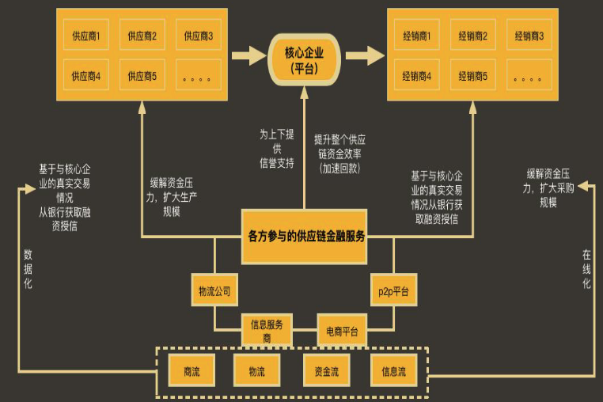

# 从供应链说起

供应链(Supply Chain,SC)是围绕核心企业，通过对信息流、物流、资金流的控制，从采购原材料开始，制成中间产品以及最终产品，最后由销售网络把产品送到消费者手中的将供应商、制造商、分销商、零售商、直到最终用户连成一个整体的功能网链结构模式。

# 什么是供应链金融？(从与传统金融比较的角度来看)

## 传统金融

供销企业是银行很少关注的区域，单独、孤立的银行业务，不关注流程和交易过程传统的金融服务是从单个行业出发提供的服务。

## 供应链金融

供应链金融是一种集物流运作、商业运作和金融管理为一体的管理行为和过程，它将贸易中的买方、卖方、第三方物流以及金融机构紧密地联系在了一起，实现了用供应链物流盘活资金、同时用资金拉动供应链物流的作用。

指银行、证券、保险等金融机构以及商业保理、融资租赁、小额贷款公司等地方金融组织通过与供应链核心企业、供应链管理机构等的合作，从供应链整体结构和信用出发，运用 自偿性融资、金融科技等方式控制风险，为供应链上的中小微企业所提供的综合金融服务。供应链金融现已涵盖钢铁、 汽车、油品、煤炭、有色、矿石、橡胶、塑料、工程机械、装备制造、化肥、纺织、水泥、纸品、 电子、 电器、 电线电缆、通信/IT、食品、农副产品等十余个行业

供应链融资形式：包括贷款、票据贴现、银行承兑汇票、保函、保理融资、 融资租赁、信用证（含国际和国内）、押汇等。

供应链核心企业：在供应链上拥有该供应链关键资源和能力，具有相对较强实力，对其供应链上下游企业群体有较大影响和支配能力的企业

## 比较事例 - 汽车制造销售

# 供应链金融解决的主要问题

信息不对称
信用不传递
四流不合一 （商品流、信息流、物流、资金流）
末端征信难

# 供应链金融vs物流金融vs产业金融

- 供应链金融: 商业银行/类金融机构根据产业特点，围绕供应链上核心企业，基于交易过程向核心企业和其上下游相关企业提供的综合金融服务
- 物流金融: 供应链金融的组成部分，指商业银行/类金融机构以对物流和资金流的控制为基础，借助第三方物流公司或核心企业的信用绑定等风险控制技术，为供应链上的客户提供的金融服务
- 产业金融: 产业是具有某种同一属性的企业或组织的集合，产业金融指商业银行/类金融机构为这一企业或组织提供的资金融通服务，其包括供应链金融
- 产业链金融: 产业内部形成了供应链，就叫产业链，等同于供应链金融

# 供应链金融vs非供应链金融

| 比较项    |	供应链金融 |	非供应链金融 |
| -------- | -------- | ------- |
| 授信主体 |	单个或多个企业群体 |	单个企业 |
| 评级范围 |	企业及整个供应链 |	企业本身 |
| 授信条件 |	动产质押/货机质押等均可 |	核心资产抵押/有效第三方担保人 |
|银行参与 |	动态跟踪企业经营过程 | 静态关注企业本身 |
|银行承担的风险 |	较小或没有 | 较大 |
|服务品种 | 品种多样 |	品种较少|
|服务效率 |	及时解决企业短期流动资金的需求 |	手续繁琐, 效率低下|
|服务内容 |	为单个企业或供应链提供持续的信贷支持 |	解决单一企业的融资需求|
|服务作用 |	提升企业及整个供应链的持续竞争力 |	仅仅环节单个企业的资金困难|

# 供应链金融vs传统银行信贷

> 传统金融是从金融的角度谈金融, 供应链金融是从产业的角度谈金融！

|区别和特点 |	银行传统信贷 |	供应链金融|
|----------|------------|----------|
|关键要素 |	以“好的资产负债表”为基础, 对企业以往的财务信息进行静态分析, 依据对受信主体的孤立评价作出信贷决策 | 评估的是个整个供应链的信用状况, 加强了债项本身的结构控制。|
|业务流程  |	是一种简单的资金借贷关系，以一个或几个生硬、机械的产品“水平式”地覆盖不同细分市场及交易链条上的各个节点、各个交易主体需求 | 是根据交易对手、行业规则、商品特点、市场价格、运输安排等交易条件, 为供应链上不同交易层次和交易地位的交易主体定制的专业金融解决方案。不仅仅是融资, 更是流程优化方案和成本降低方案|
|组织结构 |	一般参与主体只有商业银行等信贷机构和中小企业双方, 有些也需要第三方担保人的参与 | 不仅仅有金融机构、融资企业，还包括供应链上的参与企业、其他服务型企业，以及物流企业 |

# 供应链金融实操的注意和提醒

你做生意，你会不知道自己的上游是谁？你会不知道自己的货卖去了哪里？
你做生意，你找的货运公司物流司机，你连电话都没有？
四流合一的重点，不只是发票，合同，现金，最重要的是物流。现在的税务稽查，一定会穿透你的物流。倒仓移库的行为，
势必会被判定为虚假贸易。
其次，最重要的是税务开票额度，税务开票额度提不起来，所有链条都是白搭。

# 供应链金融的基本要素分析

1. 供应链金融开展的前提: 现代供应链管理是供应链金融服务的基本理念;构建供应链商业生态系统是供应链金融的必要手段
2. 供应链金融的基础和关键: 闭合式资金运作是供应链金融服务的刚性要求; 大数据、信息化、业务垂直化是供应链金融的关键
3. 供应链金融服务的对象和目标: 成长型中小企业是供应链金融服务的主要对象;流动性较差资产是供应链金融服务的针对目标

# 供应链金融的特点分析

> 供应链融资具有自偿性，商品融资的特点；自偿性是指所得销售收入优先用于归还贷款

- 还款来源自偿性: 产品设计的基础在于授信项下的资产支持，授信偿还归结于资产项下现金回流，如保理
- 操作的封闭性: 对资金流和物流的全流程控制，如动产抵押/质押授信业务
- 注重操作风险控制: 企业的信用评价相对降低，主动债项评级，风险控制重心后移至操作环节的实时监控
- 授信用途特定化: 授信项下的每次出账都对应明确的贸易背景，做到金融、时间、交易对手等信息的匹配

供应链金融的价值在于“优化和提升产业现金流”。
供应链金融并非单一的融资产品，而是度身定做的金融服务与融资的组合模式。
供应链金融需要确定一个核心企业。
供应链金融需要确立一个信用工具（或货权）。
供应链金融需要至少一个或以上的融资机构。
供应链金融的对象仅限于与核心企业有密切、商品交易关系的配套企业。
供应链金融包括很多具体的业务模式，每种模式又包含不同的产品。
供应链金融在很大程度上能减少业务风险，但对操作风险控制的要求较高。
金融机构需要动态地分析企业状况。
从业务发展、防范风险的角度看，金融机构应同核心企业建立战略合作关系

# 供应链金融的本质 - 天秤模型

- 以风险控制为基;以信息为梁;以信用为柱
- 促进金融资源;与产业资产相结合;建设供应链服务平台
- 金融需求始于供应链;金融落脚点是服务于;供应链
- 从供应链中来,到供应链中去

# 供应链金融是产业发展的必然要求

> 供应链金融是企业应对经济新常态，逆经济周期的必然选择

分工模式：
- 大而全 -> 专业化
- 企业内分工 -> 企业间分工

管理重点：
- 单位企业 -> 供应链

金融服务：
- 传统金融服务 -> 供应链金融服务

## 宏观基础

### 宏观经济

产链和供应链推动贸易全球化，贸易全球化推动金融全球化
近期央行紧缩货币，意图明显：推动经济转型、抑制资产泡沫、稳定人民币汇率

### 政策环境

互联网金融监管政策趋紧，P2P、校园贷, 医美分期等面临严格监管、新一轮洗牌在即
国家政策层面积极推进供给侧改革，发文“推应收账款融资、帮助中小企业供应链优化提升“

## 微观基础

### 中小企业融资痛点

当前国内5500万中小企业，贡献了GDP的60%，创造了80%的就业机会，但普遍面临“融资难、 融资贵、融资乱”的困境
全国应收账款总额超过26万亿，应收账款的长尾部分，规模巨大缺难以融资

### 传统金融机构服务覆盖不足

传统银行在开展保理业务融资时往往要求融资主体：以大中型企业为主，对买方的资信实力、配合程度要求较高
大多数中小企业难以获得正常的融资服务 醴 供应链金融应运而生、备受关注

# 供应链金融能创造更和谐的产业生态

创造产业生态共赢

## 核心企业收益

- 降低采购/营销成本
- 提高供应链稳定性
- 获得财务收益
- 提升资本市场表现

## 中小链属企业收益

- 降低生产成本
- 提高资金周转
- 降低融资成本
- 改善经营连续性

## 金融机构收益

- 批量获取优质、低风险资产
- 开发存量客户的增量业务
- 改善利润结构, 增加中间收入

# 数据资产案例

1. 中国某某银行，特别是其上海分行与上海某某交易所合作，成功发放了基于"数易贷"服务的数据资产质押贷款。这一贷款产品是通过数据资产区块链基础设施中的智能合约，使用数字人民币为企业发放贷款

2. 中国某某银行，推出了数据资产融资授信服务。数据资产作为抵押获取贷款，南方某某媒体集团通过工商银行获得了500万元的授信额度。

3. 某某银行，其某分行通过授信首笔数据资产质押贷款业务，支持河北地方经济和服务实体经济方面的能力不断提升。某某银行某某分行向科某电气拟授信额度1亿元，其中数据资产质押授信额度为1000万元

4. 某某银行 ，成功落地福建省首笔数据资产质押贷款。某网将持有的茶产业生态数据通过“全国数据资产登记服务平台”进行登记公示 ，取得《数据资产登记证书》某某银行按照相应的授信规则和风控手段计算，最终给予某网相应的贷款额度 ，即1000万元贷款支持。

5. 某某银行，某某分行携手深圳某某交易所成功落地首笔小微企业数据资产融资业务。深圳某某科技有限责任公司成为全国首个获得无质押数据资产增信贷款的企业 ，成功获得了1000万元的授信额

# 医疗供应链

## XXX国医业务模式

1. 银行为医院批复总额度 ，在总额度项下，医院向银行推荐优质耗材供应商
2. 银行为单个耗材供应商批复直接授信额度
3. 基于SPD系统的结算单， 医院、供应商三方进行平台在线确认
4. 供应商通过服务平台，提供结算单、明细单、发票提交融资申请
5. 银行对结算单、发票进行核验，进行放款
6. 到期后医院进行还款 ，银行锁定还款账户，到期自动扣划

## 医疗供应链风控痛点

供应商融资必须根据产品要求在指定银行开立资金专管账户或二类账户，并与医院进行结算账户变更 ， 平台同时出具法律文书告知医院专管结算账户为不可变更的唯一结算账户，解决了传统医疗供应链款项无法实现闭环的痛点。

通过spd历史数据记载与第三方数据进行比对， 以及随机抽查医院或地方政府招标信息从而确认融资客户信息的真实性

## 医疗供应链风控管理

1. 通过spd系统， 医院必须在系统内对已使用的医疗耗材结算单进行确认操作 ，并核对结算单与相应发票是否吻合 ，从而达到医院方类确权的行为。解决了传统医疗供应链环节中，医院无法对应付账款确认的痛点
2. 授信额度项下的单笔资产 ，平台将根据spd数据进行实时核对
3. 平台对全额应收帐款信息进行中登网登记
4. 企业法人及实控人进行无限连带责任担保
5. 平台将应收账款转让内容对医院进行公示 ，并出具公示涵

# 政府支持

## 八部委下发《关于规范发展供应链金融支持供应链产业链稳定循环和优化升级的意见》

为精准服务供应链产业链，促进经济良性循环和优化布局，人民银行会同工信部、司法部、商务部、国资委、市场监管总局、银保监会、外汇局下发《关于规范发展供应链金融 支持供应链产业链稳定循环和优化升级的意见》（银发〔2020〕226号）。对六个方面，提出23条政策要求和措施。

1.准确把握供应链金融的内涵和发展方向；2.稳步推进供应链金融规范发展和创新；3.加强供应链金融配套基础设施建设；4.完善供应链金融政策支持体系；5.防范供应链金融风险；6.严格对供应链金融的监管约束。

提高供应链产业链运行效率，降低企业成本。提升产业链整体金融服务水平。提升供应链融资结算线上化和数字化水平。提升应收账款的标准化和透明度。提高中小微企业应收账款融资效率。

供应链大型企业应严格支付纪律，不得挤占中小微企业利益。

建立信用约束机制。加强核心企业信用风险、供应链金融业务操作风险、虚假交易和重复融资风险、金融科技应用风险等防控

## 八部委《规范发展供应链金融意见》政策要点

支持探索使用电子签章在线签署合同，进行身份认证核查。支持银行间电子认证互通互认。

提高商业汇票签发、流转和融资效率

银行等金融机构应积极与应收账款融资服务平台对接 ，减少应收账款确权的时间和成本 ，支持中小微企业高效融资

保险机构应积极嵌入供应链环节，提供抵押质押、纯信用等多种形式的保证保险业务

银行在审查核心企业对上下游企业提供融资时 ，可侧重于对核心企业的信用和交易真实性的审查。

银行等金融机构对供应链融资要严格交易真实性审核 ，警惕虚增、虚构应收账款、存货及重复抵押质押行为。

核心企业不得一边故意占用上下游企业账款、 一边通过关联机构提供应收账款融资赚取利息。各类供应链金融服务平台应付账款的流转应采用合法合规的金融工具 ，不得封闭循环和限定融资服务方。

各类保理公司、 小贷公司、财务公司开展供应链金融业务，应严格遵守业务范围 ，不得无牌或超出牌照载明的业务范围开展金融业务。各类第三方供应链平台公司不得以供应链金融的名义变相开展金融业务

## 中央部委：发展供应链金融

- 2019年12月4日，中办、国办印发《关于营造更好发展环境支持民营企业改革发展的意见 》“推进依托供应链的票据、订单等动产质押融资，鼓励第三方建立供应链综合服务平台”
- 2019年7月9日，银保监会《关于推动供应链金融服务实体经济的指导意见》“银行保险机构应加强供应链金融产品的开发与推介，及时宣传供应链金融服务小微企业、民营企业进展情况”
- 2021年10月15日，央行新闻发布会“要支持小微企业供应链的融资。推动大型企业使用商业汇票替代其他形式的账款，指导金融机构扩大商业汇票的承兑贴现。强化互联网、大数据等科技手段运用，推广主动授信”
- 2024年4月16日，国家金管总局、工信部、发改委下发《关于深化制造业金融服务助力推进新型工业化的通知》“规范发展供应链金融，强化对核心企业的融资服务，通过应收账款、票据、仓单和订单融资等方式促进产业链条上下游企业协同发展”

## 地方政府：推进供应链金融

- 2024年6月17日，上海金融监管局、人行上海市分行、上海市发改委等七部门印发《上海银行业保险业建
设供应链金融示范区行动方案》
  - 引导金融机构开展供应链金融的线上贷前、贷中、贷后“三查”工作，建立全流程线上资金监控模式
  - 进一步扩大远程开户试点，引导金融机构合规稳慎开展异地供应链金融业务
  - 通过信息流、资金流、物流和商流的“四流合一”，突破供应链金融开展中的交易、票据、货物等真实可控难题。促进供应链票据等各类票据规范使用
  - 支持银行间电子认证互通互认

- 2024年6月，人行北京市分行、北京市金融委、财政局、国资委、经信局、政务和数据局等六部门联合出台《金融支持供应链产业链高质量发展工作方案》
  - 做好本市供应链金融综合服务平台的建设和运营工作
  - 进一步发挥应收账款融资服务平台功能
  - 探索供应链金融创新管理模式
  - 推动本市国有企业积极参与供应链金融生态创新改革先行先试
  - 加强政银企对接交流
  - 加强供应链金融规范引导和数据治理

# 三种形态

供应链融资:
- 应收
- 预付

银保监会银保监办发〔2020〕28号《关于加强产业链协同复工复产金融服务的通知》“以银行信贷资金及时清偿上游企业的应付款项或向上游企业支付预付款”:
- “银行业金融机构可通过开立银行承兑汇票、预付款融资等方式，为下游企业获取货物、支付货款提供信贷支持”
- “对于核心企业上游企业，可适当提高应收账款、应收票据或订单融资比例；对于核心企业下游企业，可适当提高预付款融资或存货与仓单质押融资比例”

# 供应链会融生态环境

- 制度环境: 供应链金融是融合产业和金融的金融创新业务, 需要产业和金融相关政策和制度的约束、支持,如物流业政策和制度、金融业的政策和制度等

- 技术环境: 供应链金融在互联网发展的背景下,互联网与供应链金融逐步融合,需要相关技术的约束、支持、如区块链技术、物联网技术、大数据技术、互联网技术、IT技术、移动互联技术、通信技术等

# 供应链金融生态源与目标

供应链金融的受益主体主要是依附于供应链上核心企业的上下游中小微企业 ，通过融入到供应链的产、 供、销各个环节，借助核心企业的信用增级提升供应链上中小微企业的信用，拓展融资渠道，缓解融资难问题。

随着中小微企业征信体系的建设，大数据、 区块链等互联网 技术的运用和成熟，以及第三方支付的闭环运行，供应链金融降低了中小微企业的融资成本，提高了融资的效率

# 供应链金融的模式

## 预付账款融资

银行以客户与上游厂商签订的商务合同为基础 ，通过签订三方协议，为客户提供预付账款融资 ，包括先票后货业务、担保提货业务、未来货权质押开立信用证业务。其中先票后货和未来货权质押开证业务在上游厂商发货之后一般会会转为动产抵质押。

预付账款融资具有三个特点：
1. 利用银行融资支付货款，减少自有资金占用
2. 预付款方式批量定购，价格优，扩大盈利空间
3. 融资手续简便，无需提供其他抵质押物或担保

## 货权质押融资

货权质押融资是企业以自有或者第三方存货提供抵/质押，银行为企业提供融资支持，并委托银行认可的监管方对抵/质押物进行现场监管的一项金融业务。

货权质押融资业务分为静态抵(质)押或动态抵(质)押两种操作方式。静态方式下企业提货时必须打款赎货，不能以货换货；动态方式下，只要总货值不低于银行要求的最低价值，可以用以货易货的方式

## 先票(款)后货 存货质押

## 保兑仓(提货担保)

### 操作流程

1. 企业、供应商与银行签署《三方合作协议》
2. 企业与银行签署相关授信协议文本
3. 企业按协议向银行缴存保证金；向供货商下订单
4. 银行授信资金（银票）支付给上游供应商
5. 企业划付赎货款项
6. 银行签发提货通知书，通知供应商按订单发货
7. 授信到期客户若未完全提货，供应商承担差额退款责任

# 供应链金融的未来市场

# 衍生出供应链金融的三个基础

- 时间差
  - 原材料加工采购存在一定的季节性, 产品销售形成收入或回款存在一定的时间差, 适合衍生供应链金融
  - 例如: 农作物生产、食材配送
- 空间差
  - 供应链涉及采购、存储、配送和销售的环节, 存在与商品所在地点转移、地域变化的场景下适合衍生供应链金融
  - 例如: 大蒜在产地和销地的贸易活动供应链金融需求产生
- 缺要素
  - 供应链价值实现环节中缺乏一些关键要素, 需要通过融资的方式补齐, 才能保障供应链或企业经营的正常运转
  - 例如: 化肥采购、饲料采购

# 哪些行业适合做供应链金融

- 汽车行业: 汽车组装、生产、销售、后服务等涉及生产供应链和销售供应链环节都会衍生金融服务需求
- 能源行业: 煤炭、电力、钢材、光伏、油气等涉及生产供应链和销售供应链环节都会衍生金融服务需求
- 三农领域: 农资、农产品、食材配送、生产机具租任等都会衍生金融服务需求
- 流通领域
  - 物流：海运、空运、管道运输、公路运输
  - 零售: 餐饮、商超

典型代表： “三通一捷”即深圳怡亚通供应链公司、深圳市阿里巴巴一达通、深圳市的普路通供应链公司、深圳创捷供应链公司

# 提供供应链金融服务的参与者主要分为四大阵营

供应链金融服务的提供者分为四个阵营：可以是进出口公司、也可以是供应商(生产企业)、互联网公司和金融机构等

# 生产领域供应链金融

## 价值

- 有利于自身供应链的建设和发展, 特别是稳定上下游关系
- 促进商流、物流、金融三个环节高效融合, 有效降低供应链风险
- 拓展产业服务化的空间和领域,更好地通过金融打造产业供应链,同时通过产业供应链的发展, 进一步带动金融资源的增值
- 实现产业与金融资源的高度融合

## 特点: 制造业供应链金融的条件

1. 自身供应链网络的建成
2. 依托自身供应链服务于上下游
3. 自己承担相应的风险, 并且管理供应链金融风险
4. 企业自身具有强大的信誉和资源
5. 制造企业具有良好的生产和技术能力

## 举例 屠宰养殖销售

## 举例 和娃哈哈合作

# 贸易领域供应链金融

## 价值

1. 有利于自身贸易业务掌控,特别是上下游贸易往来
2. 通过金融实现贸易,但是业务的真正价值往往来源于金融产生的增值,而不仅仅是贸易本身
3. 拓展贸易服务化的空间和领域,通过贸易信息的整合,将融资、物流服 务、汇率管理进行整合

## 特点

1. 能汇集行业中的供需信息
2. 能较好地管理贸易双方的信用
3. 自身具有较好的融资能力, 或与金融机构建立起良好的关系
4. 企业自身具有组织和管理物流的能力
5. 能把握贸易的全流程和各细节

# 物流领域供应链金融

## 价值

1. 有利于强化物流公司与客户之间的关系
2. 通过金融拓展服务空间,带动物流业务的发展
3. 不仅能为客户提供高质量、高附加值的物流与加工服务,还为客户提供间接或直接的金融服务
4. 提高供应链整体绩效和客户的经营和资本运作效率

## 特点

两个要件:
- 物流公司具有良好的物流服务能力,并且与产业链客户企业具有很好的战略联盟关系
- 物流公司直接或间接地在物流环节对动产进行操作和控制

# 四大趋势：在线化、垂直化、数据化、平台化

总结：供应链金融服务提供商：必须对产业链上下游的“四流”有一定控制力；

- 通过数据分析做到“四流合一”，生产出信用和风控产品
- 必须低成本地获得较多资金资源，这是赚取利润和扩大业务规模的必备条件
- 政府掌握80%的企业数据，目前越来越多的政府向社会开放企业支付，税务，能耗，社保等方面数据

供应链金融的两个基本条件：数据分析可以解决贷给谁，贷多少，怎么贷的问题，资金可解决“原材料”的问题

# 物流企业

做法：
物流企业通过物流活动参与到供应链运作中，通过整合供应链中的物流仓储网络，运输网络，配送网络，链接资金提供方，为服务对象提供融资解决方案和资金支持服务，并协同资金端进行风控。

优势：
掌控实体流动，可以动态监管
掌控仓储网络，可以静态监管
部分企业具有平台，掌控数据信息

物流企业在产业发展中起到金融中介作用，产生了很多模式，并从中获取金融收益。如存货质押

物流金融创新：物流平台化下物流金融创新

## 代销模式（控款）

## 代采模式（控货）

## 主要风险

### 质量风险

风险点：
采购过程中购买到了劣质煤炭。
解决措施：
采购的最前端压缩在站台采购， 此节点可实现每车煤炭抽样并送三方机构检测质量

### 结算风险

风险点：上游付款了不发货，下游付货了不结算或拖延结算

解决措施：
上游：先货后款、现款现货交易
下游：主要与优质央企、国企、上市公司、世界500强等企业合作

### 价格风险

风险点： 受市场影响价格波动风险
解决措施：通过合同锁定上、下游价格、赚取固定差价，风险转嫁给上游

# 供应链金融发展的三个阶段

|供应链金融1.0 | 线下“1+n”模式,银行主导 |
|供应链金融2.0  | 在线化;初步实现四流合一;资金主体  |
|供应链金融3.0  | "n+1+n"生态圈;去中心化;互联网、产业链金融高度融合 |

## 发展初期以银行为主导

在供应链金融发展初期，实施主体主要为商业银行。 在互联网+产业发展背景下 ，随着供应链金融的创新发展，银行不再是供应链金融产品与服务提供的绝对主体。掌握了大量的客户资源和供应链上下游企业真实贸易的行业龙头企业、 平台企业、物流企业等各参与方纷纷利用自身的优势，切入供应链金融服务领域，搭建供应链金融服务平台。

供应链金融实施主体依托供应链的生态圈，使得供应链上下游中小微企业之间互联互通、互惠互利。提供精准借贷，搭建起中小微企业的融资桥梁

## 供应链金融2.0初步实现四流合一

## 供应链金融3.0 N+1+N生态圈

# 如何搭建供应链体系

# 贸易--供应链金融

供应链金融: 金融机构根据行业特点,围绕供应链中的核心企业,在实际交易过程的基础上,向核心企业其上下游相关企业提供的综合金融服务
核心企业: 3个亿销售额+3个亿净资产
夹层融资: 通过夹层机构提供资金实施杠政策
保理: (比如国企)利用应收账款转让给保理商 (银行)保理商提供合同额80%融资(指定账户), 缩短回款周期并且获得夹层融资;
价值: 在真实的贸易额里利用核心企业的价值提高杠杆能力缩短帐期;增加资金流通;获得更高收益;

# 为什么要发展供应链会融

- 2021年亲国家统计局公布,工业企业应收账款18.87万 亿。
- 全国实体经济的应收账款完竟有多少?经对国家统计局相关数据测算、2021年末、工 业、建筑业、批发和零售业、受通运输、仓储和邮政业、房地产业、信息传输、软件 和信息技术服务业、租赁和商务服务业等行业应收账款为38.75万亿。
- 2021年系,全市场应收票据余额14.98万亿。
- 2021年末,全市场应收账款、应收票据38.75万亿+14.98万亿=54万亿。
- 54万亿应收账款、应收票据中,按66%需要融资,融资需求约为36万亿。
- 2023年,工业企业资产总计167.36万亿元,比上年增长6.0%,其中:应收账款23.72万 亿元,同比增长7.6%。实现营业收入133.44万亿元,比上年增长1.1%;实现利润总额 7.68万亿元,比上年下降2.3%
- 2023年4月28日,中央政治局会议"要下决心从根本上解决企业账款施欠问题“
- 2023年9月20日,国务院常务会议审议通过《清理拖欠企业账款专项行动方案》

# 供应链会融与乡村振兴

1. 促进农业产业升级 通过供应链金融的支持 ，农业产业链上的企业可以获得更多的资金和资源 ，促进农业产业的升级和转型。例如，支持农业企业引进先进的技术和设备 ，提高农产品的质量和产量；支持农产品加工企业进行技术创新，发高附加值的产品。
2. 带动农民增收致富 供应链金融可以为农民提供更多的就业机会和收入来源。例如 ，支持农村电商发展 ，帮助农民销售农品；支持农业产业化龙头企业发展 ，带动农民参与农业产业化经营。
3. 优化农村金融生态 供应链金融的发展可以促进农村金融市场的竞争 ，提高金融服务的质量和效率。 同时 ，还可以吸引更多的金融机构和资金进入农村市场 ，优化农村金融生态。
4. 推动乡村振兴战略实施 供应链金融作为一种创新的金融服务模式 ，可以为乡村振兴战略的实施提供有力的支持。通过支持农业业发展、带动农民增收致富、优化农村金融生态等方面的作用 ，推动乡村振兴战略的全面实施

# 所见即所得，货权的控制很重要

供应链金融贸易里面最核心的一个东西就是货物的所见即所得。你能看到货，你能拿得住我，拿出货，我能把它卖掉。我卖掉的货跟我合同发票里面记载的货物是一个东西，叫所见即所得，各项都能做到。

做供应链。无论你看哪个体系，很多企业过多的精力放在了票上，而经常忽视了货物。但实际上我们看从 74 号文就看到了国家现在着重的去看有没有货，你能不能看得住货的定价，你有没有参与货物流转，能不能转卖变卖，这才是最重要的。

# 中国银行贷款产品

## 中行·惠如愿·经营E贷

中国银行·个体工商户需要提供本人居民身份证及所经营企业的营业执照

产品要素:
1. 贷款金额：线上最高 50 万，线下最高 300 万
2. 贷款利息：3.95%-4.25%
3. 贷款期限：3、6、9、12 期
4. 还款方式：随借随还

准入要求:
1. 申请人年龄：20-65 周岁，具有中国国籍（不含港、澳、台）
2. 申请人：个体工商户/有限公司
3. 实际经营时长不少于 1 年，法人变更满6个月以上；

征信要求:
- 经营性贷款小于等于2；
- 网贷笔数小于等于2；
- 信用卡使用近六个月平均小于 70%；
- 要求法人过户时间6个月以上；
- 查询近一个月小于4次，近3个月小于7次，近半年小于12次，不需要收款码，需要填写收入以及佐证收入的截图

## 税贷

法人不占股可做

## 产 品 要 素

贷款额度：最高300万；

贷款利率：年化4.35%内；

贷款期限：最长1年期；

还款方式：
- 循环使用，随借随还
- 按日计息，先息后本；提前还款：无违约金

产品特点：
- 全流程线上化，无人工入
- 有中行企业网银的小微企业客户均可申请

放款方式：中行对公账户

## 征信要求

借款人无当前逾期，企业无当前逾期，近两年没有连三累6.近1个月个月查询≤4次；近半年查询≤ 123、企业对公负债笔数≤2笔，网贷笔数≤2，信用好卡最近六个月平均使用额度小于等于80%。申请人当前无司法诉讼，企业无司法诉讼；

## 准入要求

年龄: 20-65周少

借款主体:
- 企业成立满2年以上,法人变更满6个月以上;
- 在中行开立结算账户且为中行存量白名;单内中小企业客户
- 企业为经国家工商行政管理机关核准登记的国标小微企业

征信要求: 企业及法人信用状况良好。

纳税要求:
- 四纳税评级为A、B级
- 申请日前一年度“0”申报次数<4次
- 前两个年度至申请日，增值税纳税申报记录和缺失<2次
- 申请日前两个年度年均纳税>5万，纳税额增长率>20%
- 上一年度纳税申报销售收入>200万元,销售收入增长率>20%
- 上一年度资产负债率<80%，净利润>0，收入杠杆率s30%
- 无应缴未缴的税款，税务违法违章和稽核信息符合准入标准

## 操作流程

### 税务数据授权

企业登录当地税务部门网站、银税互动平台或其他税务部门认可的线上渠道，在线答署税务数据授权协议，发起对税务数据的授权

### 中行企业网银提交申请

企业登录中国银行企业网上银行，在“贷款服务”中,选择“中银企E贷”发起产品申请，系统自动跳转到新版企业网银“融资服务”下的“贷款申请”菜单 (新版网银客户可登录首页点击【融资服务】一【普惠金融贷款】一【贷款申请】直接申请相关产品) 。企业对产品基本信息、企业基本信息、账号信息及企业法定代表人信息等进行确认，在线签署中国银行相关协议文本后,发起对企业法定代表人的业务代表确认及企业相关数据使用授权 。

### 法定代表人中行个人手机银行确认及提交申请

中行企业网银提区的申请通过后，企业法定代表人需于20个自然日内 (含) 登录中国银行个人手机银行，发起产品申请，对企业及其本人基本信息、贷款申请等信息进行确认，在线签署相关协议文本后，同意接受企业业务代表，并上帮起个人相关数据使用授权，提交产品申请。

### 企业法定代表人中行个人手机银行签约

中行企业网银提交的申请通过后20个自然日内 (含) ，系统自动审批并给出授信额度后，企
业法定代表人可通过中国银行个人手机银行发起借款合同签订，借款企业与其法定代表人作为
共同借款人与中国银行签订借款合同

### 提款

在产品额度有效期内，企业通过中行企业网上银行或企业法定代表人通过中行个人手机银行均
可发起在线提款，贷款资金转入合同约定的企业结算账户

# 中国工商银行贷款产品

## 工行·经营快贷

工行经营快贷具体要求如下
期限：最长12期
额度：最高300万
利息：年化3.65%起
年龄要求：18—65 周岁
户籍要求：大陆户籍
还款方式：先息后本，随借随还
申请流程：线上申请
准备资料：身份证原件正反面照片、本人工商银行卡、营业执照、实名手机号、
特别备注：在选择贷款服务行时候，请选择你熟悉的网点或者开户行
放款地区：全国(有工商银行网点地区)
流水要求：认可支付宝和微信的收款码流水，不是转账流水，必须是收款码流水。

满足以下条件：
- 申请人为个体工商户/有限公司法人，变更时间满6个月。
- 实际经营满 12 个月以上，且经营正常，注册资本无需求
- 申请名下非黑名单、失信人员、当前无重大金额诉讼或者执行案件
- 借款人名下有工商银行或其他银行收款码，银联收款码，且流水稳定
- 收单流水稳定，且月均不低于1万元；

征信要求：
- 征信良好，无当前逾期记录，近 1 年无逾期记录，2 年内无 2 次逾期，工行无不良信用记录
- 贷记卡、准贷记卡不可为状态为冻结、呆账、止付；
- 贷款五级分类状态不可显示为次级、可疑、损失；
- 对外担保贷款状态显示不可为次级、可疑、损失；
- 申请人近1个月查询不超过3次，近3个月不超过7次，近6个月贷款审批查询次数不得超过15次(担保资格需审查)
- 申请人近期无大额涉诉记录、无大额被执行记录及失信被执行记录、无大额裁判文书记录；
- 这个产品非常看重小贷，客户有网贷未结或者小贷申请频繁的不用再试了（但实测机构 8 家一样出额，有收款码都可以试试）

### 注意

超过30万的额度,部分需要下户，很多网点比较谨慎，建议申请前提前跟选择的网点沟通好，确定额度超过 30 万能不能办理，如果不能办理，就不要从该网点进件。一旦进件，管户权就会锁定。

建议：有收款码流水的都可以试试，通过率还是蛮高的。一般收款码满 6个月。

申请流程：
1. 登录个人手机银行，依次点击“贷款—普惠贷—经营快贷-经营快贷—立即申请
2. 点击“经营快贷”，进入产品介绍页面，点击“立即申请”，进行“信息填写”，完成后点击“提交”，阅读基础信息查询和使用授权书，并进行短信验签。
3. 发票信息授权或者银联流水授权

## 常见问题

### 如何申请办理商户贷？

客户可登录个人手机银行，扫码办理（或依次点击【贷款—普惠贷—经营快贷 —立即申请】/【小微金融—我有信用—经营快贷—立即申请】，如客户无经营快贷业务授信，将进入业务选择页面，点击“商户贷”页签开始申请）

### 已申请商户贷，去哪里查看申请进度？
方式一：客户扫码查询；
方式二：登录个人手机银行，依次点击【贷款—普惠贷—经营快贷】/【小微金融—我有信用—经营快贷】，查看申请进度；
方式三：商户贷业务介绍页点击“进度查询”查看。

### 申请商户贷后，在手机银行的进度查询中查到“申请未通过”，未通过的原因是什么？

“申请未通过”表示客户暂不符合商户贷业务的办理条件。请提示客户保持良好的个人征信记录，持续经营企业，过一段时间再尝试申请。

### 申请商户贷之后很久都没有进展，在“进度查询”中看到的申请进度一直是“申请中”，如何处理？

系统正在自动审批中，请您耐心等待。如申请后第二天查询仍没有新进展，请联系您的贷款服务行处理。

### 我已经在手机银行的申请进度页面看到了额度，但服务行答复我不符合办理条件，为什么？

手机银行对客展示的授信额度仅为“预授信额度”，只是根据您的收单、经营等基本信息粗略计算的初步额度，并非最终实际可贷额度。同时“预授信额度”环节只是完成了初步信息校验，服务行还需要实地上门考察，结合企业实际经营情况等信息综合评定您的资质，因此实际是否可办理业务及可贷额度请以服务行答复为准。

### 我没有开立工行的对公账户，是否可以办理商户贷？

我行支持以个人名义办理商户贷，需办理我行个人账户及个人手机银行业务。

### 我在手机银行上看到除了“总额度”外，还看到“您另有最高 XX 元额度可解锁”，这是什么意思？
“总额度”为我行已为您授信的额度，因为您的信用情况和经营情况优，您还可以联系贷款服务行或客户经理提升授信额度，贷款服务行信息可点击“i”图标查看。

### 我办理商户贷后，提款不成功是什么原因？
方式一：客户扫码查询；
方式二：登录个人手机银行，依次点击【贷款—普惠贷—经营快贷】/【小微金融—我有信用—经营快贷】，查看申请进度；
方式三：商户贷业务介绍页点击“进度查询”查看。

#### 我在商户贷产品介绍页面点击“立即申请”后，就提示我已获得贷款额度，前往手机银行提款，是什么原因？

鉴于您信用及经营情况较好，我行已为您预先授信额度，您可直接前往提款。您可以返回手机银行首页，依次点击【贷款—普惠贷—经营快贷—马上贷款】/【小微金融—我有信用—经营快贷—马上贷款】前往提款。

## 工行·税贷

工行税贷具体要求如下
期限：最长 12 期
额度：最高 300 万
利息：年化 3.65%起
年龄要求：18—65 周岁
户籍要求：大陆户籍
还款方式：先息后本，随借随还
申请流程：线上申请
准备资料：身份证原件正反面照片、本人工商银行卡、营业执照、实名手机号、税务账号及密码。
特别备注：在选择贷款服务行时候，请选择你熟悉的网点或者开户行；
放款地区：全国(有工商银行网点地区) ；
流水要求：认可支付宝和微信的收款码流水，不是转账流水，必须是收款码流水。
执照要求：注册满两年
纳税要求：纳税等级 A/B
法人过户时间：一个月

### 征信要求

- 征信良好，无当前逾期记录，近 1 年无逾期记录，2年内无 2 次逾期，工 行无不良信用记录；
- 贷记卡、准贷记卡不可为状态为冻结、呆账、止付
- 贷款五级分类状态不可显示为次级、可疑、损失
- 对外担保贷款状态显示不可为次级、可疑、损失
- 申请人近 1 个月查询不超过 3 次，近 3 个月不超过 7次，近 6 个月贷款审批查询次数不得超过 15 次(担保资格需审查)
- 申请人近期无大额涉诉记录、无大额被执行记录及失信被执行记录、无大额裁判文书记录

# 中国邮政储蓄银行

## 邮储·税贷

### 具体要求

期限：最长 12 期
额度：最高 200 万
利息：年化 3.65%起
年龄要求：18—65 周岁
户籍要求：大陆户籍
还款方式：先息后本，随借随还
申请流程：线上申请
准备资料：身份证原件正反面照片、营业执照、实名手机号、税务账号及密码
特别备注：要提前选好客户经理的名字（对公客户经理）
执照要求：注册满两年
纳税要求：纳税等级 A/B/M
法人变更要求：满一个月（满一个月系统可出额度，放款看客户经理要求）

### 征信要求

- 征信良好，无当前逾期记录，近 1 年无逾期记录，2 年内无 2 次逾期，工行无不良信用记录；
- 贷记卡、准贷记卡不可为状态为冻结、呆账、止付
- 贷款五级分类状态不可显示为次级、可疑、损失
- 对外担保贷款状态显示不可为次级、可疑、损失
- 申请人近 1 个月查询不超过 3 次，近 3 个月不超过7 次，近 6 个月贷款审批查询次数不得超过 15 次(担保资格需审查)；
- 申请人近期无大额涉诉记录、无大额被执行记录及失信被执行记录、无大额裁判文书记录

### 申请流程
1. 下载邮储企业银行
2. 依次点击“注册—实名认证—绑定企业—绑定客户经理—选择小微版本—数据服务（复制链接用浏览器打开授权）
3. 一键测额— 预测额度——立即申请

# 中国农业银行

## 农行商户e贷-助业快e贷

准入条件：
1. 年利率 3.45%起
2. 个体户、有限公司均可
3. 线上最高50万，线下最高300万
4. 法人变更线上要求满3个月，线下要求满6个月（线下要求有房产，按揭全款均可）

征信要求：
1. 不看信用卡负债
2. 不看网贷笔数
3. 查询近一个月不超过3次，近三个月查询不超过9次；
4. 经营性贷款小于等于2笔；
5. 线下不看查询、不看负债、不看贷款笔数，只要流水可以覆盖（流水*0.2-信用类负债=额度）

注意：个体户、有限公司均可注册满一年，app测额度需要银联收款码入网时间超过12个月，线下不需要由银行收款码，微信、支付宝、银行卡、对公流水都认

### 常见问题：

#### 如何判别商户收款是否通过银联渠道清算？
答：①所有银行的收单工具均通过银联渠道清算。 ②收款工具（收款码、扫码盒、收银机）印有“银联”或“云闪付”标识的，是银联渠道清算。 ③对于无前两项特征的第三方支付，可使用微信扫一分钱，在微信账单详情里查看，若显示“由中国银联提供收款清算服务”，则为银联渠道。

#### 客户已办理惠农 e 贷、纳税 e 贷等贷款还能申请银联“商户 e 贷”吗？
答：可以办。只要客户当前未持有“助业快 e 贷”和“网捷贷”，均可申请银联“商户 e 贷”。

#### 对公商户能否办理银联“商户 e 贷”？
答：满足一定条件的可以。若对公商户在银联入网时留存的公司负责人信息（手机号、身份证号码）与借款人掌银信息保持一致，且工商注册留存信息通过校验，则可申请。

#### 银联“商户 e 贷”会扣减吗，客户已有他行信用贷款，还能申请吗？
答：银联“商户 e 贷”采用扣减模式，但设定了一定的免扣减额度，且总行做了特别优化（免扣减额度更高），支持抢挖他行客户，已有他行信用贷款的客户也可申请银联“商户 e 贷”。

#### 客户营业执照负责人是老公的名字，银联清算收款入账是老婆的卡，可以申请银联“商户 e 贷”吗？
答：满足一定条件的可以。银联入网留的谁的信息（手机号、身份证号）就以谁的名义申请，但申请人必须是经营店铺实际控制人且非公职人员。注：掌银申请时统一社会信用代码可以不录。

#### 客户申请 50 万及以内免 K 宝签约认证不通过？
答：免 K 宝需要客户提前做好设置：
①掌银-我的-安全中心-转账设置-密码支付。 ②打开移动流量，不能纯 wifi。 ③双卡手机的流量卡号码要与掌银登录号码一致。

#### 一个客户有多个营业执照作为收单，是否可以不录统一社会信用证代码？同一控制人多个商户收单都能提取数据吗？
答：可以不录统一社会信用代码。如果入网的时候，填写手机号，身份证号是正确的，就可以。

#### 客户已有分行预授信“商户 e 贷” 、 “药商 e 贷” 、 “烟商 e 贷”等产品，可以提前还款申请银联“商户 e 贷”吗？
答：不建议提前还款，还了后要终止自助循环额度、合同履约完毕才能再次申请，且还了后不一定有银联“商户e 贷”额度（成功率只有 20%），具体额度有多少也是未知。

#### 客户申请时各类错误代码怎么解决？
答：常见错误代码：ESPSER2006：暂未调取银联数据。原因是银联入网留存手机号和身份证号码与掌银不一致，可尝试修改手机号码或不录统一社会信用代码。
ES9999：错误，可以稍后试试。
ES369：所有模型都不符合条件，可以走传统的分行预授信“商户 e 贷”线下流程，导入白名单。
ES421：信用或担保类余额过高，或授信未达到起点金额。
374：评级模型编码不对，可以通过超柜试试。
358：征信问题，无解。
ESSR 开头/ESPSER30002 ：可以在个贷质检系统里面看原因，要么就是当天的操作过多。
ES339：信用卡交易状态不正常。
ESELPLC0052：放款合约被冻结，需去网点查看账户情况。
ESPSER5101：客户信息不完善，请联系线下网点办理。一是看 C3 客户管理模块的客户基本信息的地址对不对，
要 6 个中文以上。二看 C3 客户的个人联系方式，手机号不能为空。

## 农行·税贷

### 客群要求

1. 年龄要求为18-65周岁
2. 企业股东为自然人，且持股比例不低于20%，企业经营2年及以上；
3. 近3个月不能有法人变更，刚变更股权可准入
4. 近1年销售收入大于20万，年销售额同比降幅不超过40%

### 纳税要求

1. 纳税评级：A、B级
2. 纳税金额：近一年纳税总额大于2万，实缴3000元以上
3. 开票金额：近一年开票不低于20万

### 征信要求

征信：近半年不能有逾期，近2年无2，累计逾期次数不超过6次；不能有对外担保情况；不能有官司和诉讼；不能有农行未结清的对公业务；

查询：无明确要求，最好三个月不超过9次负债：不能有农行的经营性贷款；他行的授信不能超过两家；在他行信贷余额不能超过500万元

### 其他要求

1. 当前不得有未结的逾期缴税、违法开票等违法违章
2. 近两年无税务部门认定严重失信情形，保持盈亏或者不亏损
3. 上一年度利润表或当年度累计利润亏损不能高于10%

# 中国建设银行

## 建行·惠懂你·商户云贷

额度: 最高300万 
利率: 年化4.25%
期限: 12期
还款方式: 先息后本

### 产品特点

免托押担保, 收款流水授信
纯线上加线下审批，秒到账
全国地区可申请 

### 准入条件 (参考)

年龄: 18 (含) ~ 65周岁(含) 

借款主体:
1. 借款人为小微企业或个体工商客户
2. 借款人拥有实体店铺且正常经营
3. 借款人为店铺法人需在位满一年
4. 店铺拥有银联ps或聚合码收款
5. 店铺收款流水量月均大于3万元

企业允许类型：
- 个体户 有限公司（有实体店铺经营）
- 商户能提供近12个月的足额流水
- 商户法人名下无银行未结清贷款

特别说明：
- 50万以内放款到建行储蓄卡
- 50万以上需开通建行基本户

### 征信要求（参考）

贷款信用卡查询：最近3个月不超过7次
历史逾期：半年内无1一年内无2
负债要求：个人负债不超200万
企业负债：企业负债不超500万
无对外担保贷款，无司法纠纷，无债务纠纷，企业征信上的贷款不超过5笔

### 提额技巧

建行惠懂你提额操作流程详版教学:
1. 下载建行惠懂你APP、二维码、建行微信小程序
2. 注册—实名认证—创建企业—找到我的安全中心—设置好交易密码，返回首页，精准测额；
3. 个体户出初始额度不要动，准备身份证、执照、手机号码、一类卡、建档几要素；
4. 建档完成或者开建行一般户完成—点贷款—通道会自动跳个体经营快贷或信用快贷，出额度后，点提额，找到对应的端口，点击我要提额划行根据公司的规模性质来人员 销售金额 资产。个体户可以3人。60万，100万。有限公司可以10人。600万，1000万。
5. 终审额度出来之后千万不要点授权。如果惠懂你授权之后有部分地区自动把税务局一起授权，可能操作时候额度变0，一定要根据客户企业真实资质来判断是否需要授权，如果公司就几千的纳税就没多大意义去授权税务。
6. 如客户需要提额，先看是否挂上银联数据，如客户额度30万显示(银联专享、拉卡拉、商户专项)，可以先锁额，再挂税授权。在点信用快贷刷新额度。(步骤是先点贷款，后点测额， 再授权)；
7. 如果客户是有限公司，企业资质非常优质，信用快贷才出 30万额度，这时候不要着急去授权税务，先把额度锁了不支用。锁完额度再去授权出流水或纳税的额度，基本操作 100 万。那么客户能多拿几十万额度。客户能否出300万取决于客户的日存日结息，跟纳税额度，开票流水的额度，基本上100万。
8. 客户资质很好的情况征信也是很好的情况推动税务还是没有额度，要么操作手法不对，要么银行更新太慢，要么税务维护。可以根据实时的情况来解决这个问题， 建行 3.0 模式，全国的发票贷已经开通了只是手法的问题。卡额度可以变更手机号码解决千万不能再次授权税务。但是目前换手机号跳风控。需要配合解风控。
9. 银联为 0，点过提额也是 0，先拉征信排除评分卡拒绝，在拉商户流水或一般户基本户流水排查。如嫌麻烦可联系行内经办查后台额度。如后台没额度征信也 OK，可挂大小码进去授权出额度

### 提额攻略汇总

1. 测额有额度，没有收款码

解决方法:为后台开虚拟账户+流水

2. 测额有额度，终审为0，点击提额为0，有银联标志。

解决方法:开立对公账户，可以提额

3. 测额0，终审0，但是有银联标志

解决方法:提升收款码或pos机交易流水，只要这个流水大于负债，如没有对公账户可去建行办理对公户后即可提额放款。

4. 无额度、无银联标志、无收款码、无纳税这种

解决方法:可办理建行收款码后多使用增加收款流水，最少3个月(6个月最好)后再次申请提额

### 如何绕过开股东会流程

开通小微快贷: 主管盾登录——服务管理——业务管理——开通——信贷融资、小微企业快贷——开通——单人操作模式（也可选双人）、开通——开通成功，退出登录。

授权实际控制人: 再次插入主管盾登录——信贷融资——小微企业快贷——我要快贷——马上授权——选择账号，核对实际控制人信息，阅读、同意并勾选协议，确认——授权成功。

随后，实际控制人通过个人网银/手机银行/建行惠懂你app操作贷款流程即可

### 惠懂你提额拉评分方法

- 在建行存款、理财；
- 在建行办理信用卡；
- 在建行办理个人贷款；
- 按时还款；
- 多用建行卡消费；
- 多用建行手机银行等电子渠道；
- 在建行代发工资；
- 通过建行缴交公积金；
- 在建行办理证券资金存管；
- 使用建行卡公益捐款

### 惠懂你提额技巧

很多朋友都知道惠懂你提额时(商户云贷）绝大部分客户最多100万，一看到别人给客户提额到100多万，就表示很惊讶和意外，还有羡慕。

这个时候你在想，为啥我的客户只能提到100万呢？如何突破100万限制达到300万呢？其实归根到底的原因为，建行为了防范金融风险，后台在惠懂你的贷款规则上，做出了首贷限制，这个限制的金额就是绝大部分客户首贷金额不能超100万。

因此针对这一规则，我们破解的方法很简单，常规操作方法是，借款一笔小额还款以后三天以后操作，这样就完美避开了首贷规则，不要觉得这个方法很简单，毕竟又有多少人明白其中道理呢？

个人操作分享：首次贷款可以直接出100额度的客户，我一般第一笔让客户支用95或者5万 ，第二天我会让他还款5万，隔三天我在提额，这样客户基本都能提到100多万，资质优良的突破200万也是可以实现的。

建行惠懂你提额重要技巧:
- 刷15天流水就能出额度卡好8号刷新AUM值，跟 21 日结息日。很多客户被中介营销后自己回去刷了十几二十万流水，过了十五天后中介就能点出来额度了。
- 非建行基本户，非建行储蓄卡，汇款过去，对方如是建行储蓄卡、建行基本户，一般系统都会给关联额度

### 问题

#### 无税无票无收款码无流水的，可提额吗？
暂时不做这种哈，只做真实经营的商户，合规第一；

#### 这几天点过提额了，今天可以找你提？
本月测过的商户，均建议次月再办理，否则意义不大

#### 征信良好有他行收款码，但是没有和建行打过交道的可以吗？
没和建行有关联，相当于建行白户，出额概率很小，建议首先办理建行收款码，收款码下来之前即可申请

#### 法人不是实际控制人，法人是否可以申请？
建议在建行维护一下，变更实际控制人；

#### 老法人之前在建行在贷，新法人还可以申请么？
一个企业在建行只能有一笔贷款，老法人结清之后，新法人才可以办理

#### 建过档了，申请时显示暂不符合该项贷款申请条件流水号；
经查流水号问题类型为内控，这种基本近期无解

#### 建行惠懂你，我的，我的企业，没有企业维护选择，怎么办？
这种需要到网点维护后才可以办理

#### 商户资质良好（流水多，征信好），为啥出额才1万？
这种大概率因为数据录入出错，只能次月开过公户后重新来过

#### 走对公提交时，没有查到组织机构代码证号，怎么办？
这个问题比较麻烦，很多商户反映说银行明明已经给录了，但是依然显示查不到，除了找银行外没有好的解决办法了

### 养码曲线提额方案

合作客户类型:
1. 客户在惠懂你APP必须有终审基础额度
2. 个体及有限公司皆可、有实体的最好
3. 客户必须签订融资居间合同

养码所需资料:
1. 建行储蓄1类卡、手机银行预留手机卡（需与银行卡预留手机号一致）如能把控拿捏的客户则不需要压资料
2. 我方新办的云闪付收款码电子照片
3. 营业执照、身份证复印件、征信、人法网、及大数据评分报告

刷流水细节方案:
日流水3-20万、笔数不低于24笔、早中晚可以各刷一笔、根据客户执照类型进行模拟真实流水、并间接性停刷、

准备工具:
一个身份证可以实名3个微信、2个支付宝、一个云闪付、也就是说一个人一天可以刷10笔左右、一天想达到24笔以上则至少需要3至4个人、还要一人专门负责统计流水账及每日向团队4人转工具款；

提额周期:
1. 按照以上方案养码、30天第一笔50万左右、60天第二笔可达100万、90天以上可以拉满300万、（如流水每天在15-20万左右、15天即可出100万）如果客户还需要资金可选择其他银行同类产品继续融资
2. 10天100万暴力出额方法=定存500万以上10天即可（此操作有资金风险；慎重）；

养码提额费用:
养码提额市场价一般8-10个点左右、给到渠道4-6个点、如客户第一笔钱下来后想用自己的钱给让我们操作养码则收取2-5个点、一个客户平均需要3-20万每天、根据自己资金看养多少个客户

### 50个打压建行贷款提额的点
- 非本地户口；
- 非本地工作；
- 非本地居住；（简称“三非”客户）
- 信用卡张数太多
- 信用卡额度太低
- 信用卡额度使用率太低
- 信用卡使用率太高
- 信用卡平均使用额度太高
- 单张信用卡额度太高
- 单张信用卡额度太少；
- 贷款笔数太多
- 贷款笔数太少不怎么和银行打交道
- 有小额贷款
- 有消费金融类贷款
- 有微粒贷
- 有贷贷卡、有生意人卡
- 有先息后本的贷款
- 有贷款和信用卡逾期、有连续逾期
- 没社保
- 没公积金；
- 社保个人窗口交
- 社保挂靠
- 社保单位和公积金单位不一致
- 社保基数太低
- 公积金基数太低
- 位交社保人数太少
- 社保断交
- 查询次数太多
- 贷款查询太多；
- 担保资格查询
- 名下有个人担保
- 贷后管理查询太多
- 配偶不能接电话、不能知道贷款
- 单位没座机
- 不能考察
- 没有经营场地
- 没流水
- 提供不了资金用途；
- 单位注册时间短
- 负债高
- 年龄大
- 高危行业、高风险行业
- 没单位
- 没稳定收入
- 未婚、离婚
- 是法人、占股少、有暗股
- 没开票纳税

【有限公司】 找到首页点发款申请进去有初始额度成为0点右上角提额度 找到我是商户点三次 单点授权交易信息 点二次 第三次把拉卡拉一起授权。

【个体户】 先点商户云货 提额单点交易信息授权点二次【o额度】去结算云货申请 再去首页授权 贷款申请[客户有标为0】找到建行手机APP搜索龙信商 黄色钻石以下基本都客户大数据评分不够需要养两个月贷款申请没出额度在首页找到 结算云货 进行申请最店再申请商户云贷

### 建行AUM提额法

什么是建行AUM提额法？
建行提额是有明确的AUM指标，这是建行提额最基本的审核标准。AUM是客户在建行的总资产规模，你的信用卡额度有多高就证明你在建行的AUM值是多少，信用卡额度和AUM值成正比。AUM包涵了你在建行的存款、基金、国债、理财产品、保险等；每隔半年建行评估一次客户的AUM值等级，从而提升或降低额度。

建行如何计算AUM值？
计算公式：采用月日均AUM指标，当月日均存款余额+当月日均投资额，当月日均存款余额=（∑ 客户某一账户存款余额*当月实存天数）/30当月日均投资额=∑ 客户投资总额/30每月按照AUM评估后定级，更高标准客户升级，降低标准的客户降级，新增客户保留评估等级。如果某客户连续3个月评定等级低于原等级标准，则第4个月开始被银行列为“关注客户”，如当月提升到原等级状态解除关注。
注：AUM只评估存款、投资理财、有效流水；不包含信用卡消费金额及房贷车贷。AUM值每月8号更新，9号可以查看。携带本人身份证可到建行任意网点查看。

如何提高AUM值？
1. POS机的结算卡设置为建行储蓄卡，流水一定要过夜24小时。
2. 可以通过搬砖，结息法，购买基金，理财，国债等来提高AUM值POS机的结算卡和结息法

#### 建行POS机的结算卡和结息法

1、为什么建议把POS机的结算卡设置为建行的储蓄卡呢？
因为，你用POS机刷的每笔钱都会到你的建行储蓄卡，不管你刷哪家银行的信用卡都一样会到你的建行储蓄卡里；不要急着转出来，隔夜放24小时。比如：你一个月要刷卡30万，按照AUM月日均算那每天也有约1万的AUM值；如果你刷卡可能更高呢，是吧！那你的AUM值就会增长很多。

2、为什么推荐大家用结息法？
因为，建行固定提额周期是6个月，临时的周期不稳定，有时两个月给，有时一个月就给，这里我们只讲固定额度。用结息法就是为了6个月提额周期做两笔大结息流水，大家都知道建行是3个月结算一次流水。3月21、6月21、9月21、12月21号，在一年这4个日子要到之前，19号20号存一笔大额存款到建行储蓄卡里过夜。这就是利用结息法提高AUM值进行提额；

### 建行惠懂你续贷操作流程

我要续贷——申请贷款续贷——我已阅读征信授权，确定——归还利息，确定——核对续贷金额，下一步——进入公证赋强，输入邮箱，正楷签名，继续——勾选借款合同，同意申请——正楷签名，保存，确定——核对明年贷款到期时间，续贷成功；️️
提示：办理续贷流程前，请保证账户余额足以覆盖当期利息，否则无法成功。

解除x207,171，详细教程，及话术。（百分之百有效）:
建行银行 app 存10000，立即办理存单质押。办理失败，上面会提示x207，或者X171。这个时候，客户经理一般会跟客户说，他资质不符合，办理不了，这个时候一定要记住客户经理的名字，跟办理贷款所在支行。
重点：教客户本人致电95533，人工客服，反馈"本人在你们银行有存款，最近生意上缺资金想办理质押贷款，你们客户经理 xx ，服务态度差，不熟悉业务，不给我办理，麻烦帮我反馈一下，谢谢您。
"流程"客服组，反馈工单，会投送给办理质押的网点分行，进入跟单流程，"分行管理组首先会查询该订单办理结果，跟报错方式，进行精准判断"，确实存在x171,x207，不是属于客户征信问题，就会解除，并致电给客户重新去该行办理质押快贷业务。质押快贷放款后，分行管理组，会把改工单结果反馈给客服组，客服回访客户，问题解决"。然后进会懂你，申请即可，解除x207,x171完毕

### 去开对公账户注意事项：

法人带上营业执照原件，公司公章法人私章，去建行网点开对公账户，开通对公账户后需要开通网银转账功能。开户时不要说是为了贷款，去之前一定把手机上下载的惠懂你APP删除。切记不要让银行工作人员操作你手机去点授权，乱点贷款，毕竟他们也有任务，但是他们无法帮你提额；

