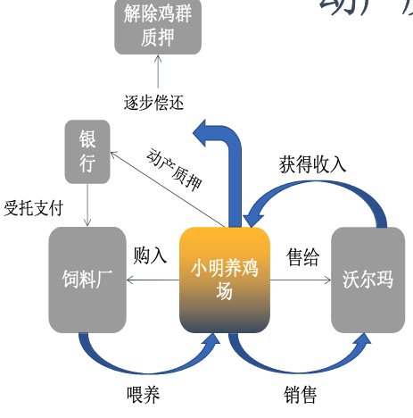
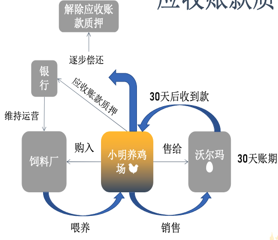
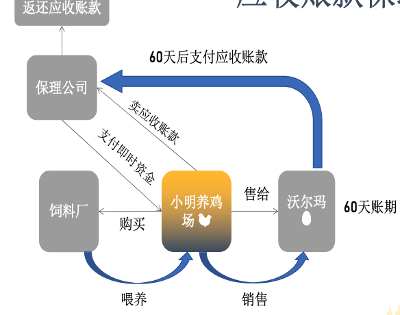
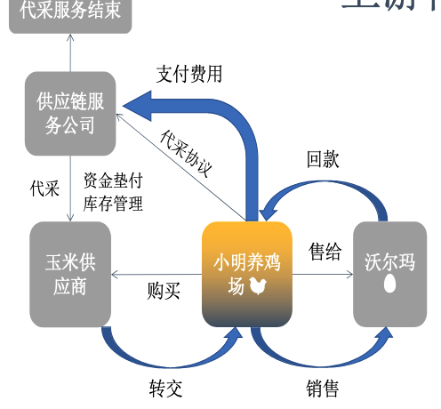
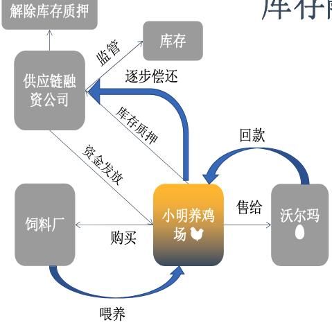
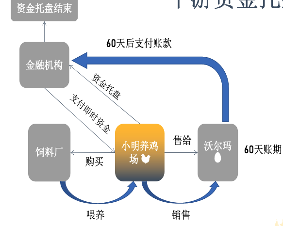
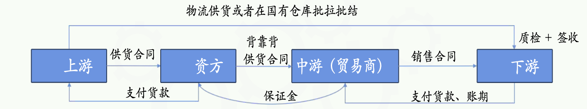
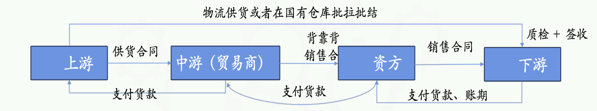

# 银行

## 动产质押

银行动产质押是指企业将其拥有的动产(即可以移动的财产,如库存商品、原材料、机械设备等)作为担保物,向银行申请贷款的一种融资方式

### 举例 养鸡场

通过动产质押,小明能够利用现有的鸡群作为担保,获取必要的资金来购买饲料和升级设备, 从而扩大养鸡场的规模;一旦贷款偿还完毕,质押的鸡群就可以自由销售,不再受银行控制。

背景: 小明拥有一个养鸡场,专门养殖肉鸡供应给当地的超市和餐馆。
步骤 1: 扩大生产 随着市场需求的增加,小明计划扩大养鸡场的规模,增加养殖数量。
步骤 2: 资金需求 扩大规模需要更多的饲料和设备,但小明目前的资金不足以支付这些额外成本。
步骤 3: 寻求融资 小明向银行申请贷款,以购买更多的饲料和升级设备。
步骤 4:动产质押 银行同意贷款,但要求小明提供担保。小明决定使用他现有的鸡群作为质押物。
步骤 5:评估与贷款 银行对小明的鸡群进行评估,确定其价值,并据此提供相应金额的贷款。
步骤 6:购买饲料和设备, 小明使用银行贷款购买所需的饲料和升级养鸡设备。
步骤 7:养殖与销售。小明用新购买的饲料喂养鸡群,并使用升级的设备提高养殖效率。当鸡群成熟后,小明将它们卖给超市和餐馆。
步骤 8:收入与还款 小明从销售肉鸡中获得收入,用这些收入逐步偿还银行贷款。
步骤 9:解除质押 随着贷款的逐步偿还,小明质押的鸡群不再作为担保,银行解除对这些鸡群的控制。

## 应收账款质押

银行应收账款质押是一种融资方式,其中企业将其应收账款(即企业因销售 商品或提供服务而产生的、尚未收到的款项)作为担保,向银行申请贷款。

### 举例

小明的应收账款作为质押物,帮助他从银行获得了贷款。银行根据应收账款的可靠性和价 值来决定贷款金额,并在小明收到超市的款项并偿还贷款后解除质押。

背景: 小明经营着一家养鸡场,专门为当地的超市供应新鲜鸡蛋和鸡肉。
步骤 1:销售与赊账 小明向超市销售鸡蛋和鸡肉,但超市通常有30天的付款期限,即赊账销售。
步骤 2:资金需求 在超市付款之前,小明需要资金来购买饲料和支付工人工资,以维持养鸡场的 日常运营。
步骤 3: 寻求融资 由于小明手头紧张,他向银行申请贷款以解决短期资金问题。
步骤 4: 应收账款质押 银行同意提供贷款,但要求小明提供担保。小明决定将他对超市的应收账款作为质押物。
步骤 5:评估与贷款 银行评估小明的应收账款(即超市未来30天内将支付的款项)的价值,并据此 提供相应金额的贷款。
步骤 6:维持运营 小明使用银行贷款购买饲料和支付工资,确保养鸡场的正常运营。
步骤 7:收款与还款 30天后,超市支付了小明的鸡蛋和鸡肉款项。小明收到款项后,用这些收入来偿还银行贷款。
步骤 8:解除质押 随着贷款的偿还,小明的应收账款不再作为质押物,银行解除对应收账款的控制。

## 应收账款保理

银行应收账款保理是一种金融服务,其中企业将其应收账款转让给银行或保理公司,以换取即时的资金或现金流。

### 举例

小明通过应收账款 保理的方式,将他对超市的应收账款卖给保理公司,换取了即时资金。保理公司根据应收 账款的可靠性和价值来决定提供给小明的资金金额,并在超市支付款项后结算保理费用,将剩余资金返还给小明

背景: 小明经营着一家养鸡场,向多家超市供应鸡蛋和鸡肉。超市通常在收到 货物后的60天内付款。
步骤 1: 销售与赊账 小明向超市销售鸡蛋和鸡肉,但超市需要60天的赊账期。
步骤 2:资金需求 小明需要资金来购买饲料和支付工人工资,以维持养鸡场的日常运营。
步骤 3: 寻求保理 小明决定将他的应收账款卖给保理公司,以换取即时资金。
步骤 4: 保理协议 小明与保理公司签订协议,保理公司同意购买小明的应收账款,并提供一定比例的即时资金。
步骤 5: 评估与资金提供 保理公司评估小明的应收账款,并根据评估结果提供给小明80%的即时资金。
步骤 6:维持运营 小明使用保理公司提供的即时资金购买饲料和支付工资,确保养鸡场的正常运营。
步骤 7: 超市付款 60天后,超市向保理公司支付了小明的应收账款。
步骤 8:资金结算 保理公司收到超市的款项后,扣除之前提供给小明的资金和保理费用, 将剩余的资金返还给小明。
步骤 9: 保理结束 小明的应收账款不再作为保理对象,保理过程结束。

# 供应链

## 上游代采

供应链上游代采,通常被称为"代采购"或"代理采购", 是指在供应链管理中,一个企业(通常是一个供应链服务提供商或物流公司)代表另一个企业(即客户企业)进行原材料、商品或服务的采购活动。

### 举例

供应链服务公司通过上游代采服务,帮助小明解决了即时支付玉米供应商费用的问题。小明利用代采服务,可以保持现金流的灵活性,同时确保养鸡场的饲料供应不中断。供应链服务公司则通过提供资金垫付和库存管理服务, 赚取服务费用,同时帮助小明优化资金流和库存管理。

背景: 小明经营着一家养鸡场,专门生产鸡蛋供应给超市和农贸市场。

步骤 1: 原材料需求 小明需要定期购买玉米作为鸡的饲料。玉米供应商要求现金交易,但小明希望保持手头现金用于其他经营活动。
步骤 2: 寻求代采服务 小明联系了一家供应链服务公司,该公司提供上游代采服务。
步骤 3:代采协议 供应链服务公司与小明签订代采协议,同意代替小明向玉米供应商购买所需的玉米。
步骤 4:资金垫付 供应链服务公司使用自己的资金垫付购买玉米的费用,然后按约定的价 格将玉米转交给小明。
步骤 5:库存管理 供应链服务公司可能还提供库存管理服务,帮助小明管理玉米的存储和使用,确保养鸡场的饲料供应稳定。
步骤 6:销售鸡蛋 小明使用供应链服务公司代采的玉米饲养鸡只,生产鸡蛋,并将鸡蛋销售给超市和农贸市场。
步骤 7:回款与偿还 小明从超市和农贸市场收到鸡蛋销售款项后,按照代采协议的约定,向供应链服务公司支付代采费用和垫付的资金。
步骤 8: 服务结束 小明完成支付后,供应链服务公司的代采服务结束,小明可以继续享受稳定的饲料供应,而无需一次性支付大笔现金。

## 库存融资

供应链库存融资是一种金融活动,它允许企业利用 其库存作为质押物来获取 贷款或信用额度。这种融资方式特别适用于那些拥 有大量库存但需要即时资金来维持运营的企业。

### 举例

小明通过库存融贷的方式,将鸡蛋库存作为质押物,换取了银行或金融机构的贷款。这种融资方式允许小明在不立即出售库存的情况下,获得所需的资金来扩大生产和满足市场需求。库存融资帮助小明解决了短期资金需求,同时保持了库存的完整性,直到贷款被偿还。

背景:
小明经营着一家养鸡场,生产鸡蛋供应给超市和农贸市场。他拥有一定量的鸡蛋库存,但由于季节性需求增加,需要资金来扩大生产规模或购买更多饲料。

步骤 1: 库存评估
小明决定利用现有的鸡蛋库存来获取资金。他首先需要对库存进行评估, 确定库存的市场价值。

步骤 2: 寻找融资
小明联系银行或金融机构,提出库存融资的需求。

步骤 3: 库存质押
银行或金融机构对小明的鸡蛋库存进行审查,并同意接受这些鸡蛋作为质押物,提供相应的贷款。

步骤 4:资金发放
银行或金融机构根据鸡蛋库存的评估价值,向小明发放一定比例的贷款。

步骤 5: 库存监管
为了确保质押物的安全和价值,银行或金融机构可能会要求小明将鸡蛋 存放在指定的仓库中,并由第三方监管。

步骤 6: 销售鸡蛋
小明利用获得的资金购买更多饲料,扩大养鸡场的生产规模。随着生产增加,小明继续向超市和农贸市场销售鸡蛋。

步骤 7:回款与还款
小明从销售中获得收入,逐步偿还银行或金融机构的贷款。

步骤 8:解除质押
随着贷款的偿还,银行或金融机构解除对鸡蛋库存的质押权,小明重新获得库存的完全控制权。

## 下游资金托盘

供应链下游资金托盘(或资金托盘服务)是一种金融服务,通常由金融机构或供应链管理公司提供, 旨在帮助供应链中的下游企业(如分销商、零售商等)管理其资金流和库存风险。

### 举例

供应链金融中的下游资金托盘供应链中的上游企业(如生产商或供应商)为了支持下游企业(如分销商或零售商)的资金流动性,提供一种资金支持或信用延期。

背景:
小明的养鸡场向多个超市供应新鲜鸡蛋。超市通常在收到鸡蛋后的60天内付款给小明。

步骤 1:销售与信用期 小明与超市签订合同,同意在超市收到鸡蛋后的60天内收到付款。

步骤 2:资金需求 小明需要资金来购买饲料和支付工人工资,以维持养鸡场的日常运营。

步骤 3:资金托盘服务 小明联系了一家提供资金托盘服务的金融机构。该机构同意在鸡蛋交付给超市后立即支付小明大部分款项,而不是等待超市的60天付款期。

步骤 4:信用风险管理 金融机构可能会对超市的信用状况进行评估,并可能要求小明提供一定的信用保险或担保。

步骤 5:资金使用 小明利用金融机构提前支付的资金购买饲料和支付工资,确保养鸡场的正常运营。

步骤 6: 超市付款 60天后,超市向提供资金托盘服务的金融机构支付鸡蛋款项。

步骤 7: 资金结算 金融机构在收到超市的款项后,扣除已提前支付给小明的金额和相应的服务费用,将任何剩余的资金返还给小明。

步骤 8: 服务结束 随着超市付款的完成,资金托盘服务结束,小明可以继续他的业务运营。

# 供应链工具玩法

## 产品一：代采+控货（也叫上托、前托）

借款人缴纳保证金比例： 20%-30%
额度：最高10亿元
综合成本：年化9%-13%（可按周计息 0.25%，摊薄实际成本约在年化小于7%）+ 小款（即，贸易分润）
还款模式：以周息差价为解押销售浮动价
目标行业：大宗原料、制造业、贸易

### 准入门槛：

1. 上游（卖方）是核心企业（广义，见以上定义）
2. 上游最好是货源头
3. 一般不做预付款锁价、锁货。除非是标准农产品，而且上游是货源端的核心企业。资方采购时是“现款现货 ” 原则；资方释放“控货权”时也是“现款现货”
4. 用资方抬头切入采购链，签订背靠背购销合同
5. 代采货物放置监管仓库

### 好处：

代为采购适用于具有融资需求的下游中小企业，企业因规模小、融资信誉不高向银行贷款具有一定难度，因此选择代为采购向供应链管理企业进行融资，有利于减少资金占用，并有利于稳定上下游的合作关系。

采购代理适用需要集中精力经营主要业务、对上游供应市场了解不足的企业，通过选择采购代理模式有利于降低采购成本，提高采购物资质量，并节省时间与精力专注于企业核心业务

## 账期托盘（也叫下托、后托）

托盘（或代销）
提前支付比例：配资比例一般70%~80%，但特别优质项目可谈到85%。
额度：最高10亿元
综合成本： 年化9%-13%（可按周计息 0.25%，摊薄实际成本约在年化小于7%）+ 小款（即，贸易分润）
还款模式：以周息+差价为代销售浮动价，合同约定回款日期为计息终止日，同时设有7-15天的宽限期。
目标行业：大宗原料、制造业、贸易

### 准入门槛：
1. 下游（买方）是核心企业（广义， 见以上定义）
2. 常规销售资质（特殊资质的需配合资方获取资质）
3. 资方与下游签订背靠背购销合同或者资方为中标单位
4. 账期最好不超过60天，建材的不超过180天

### 好处：
代为销售模式适用于需要加快资金回笼的中小企业，选择代为销售模式有利于减少应收账款带来的资金占用，同时不会增加资产负债表上的债务余额。

