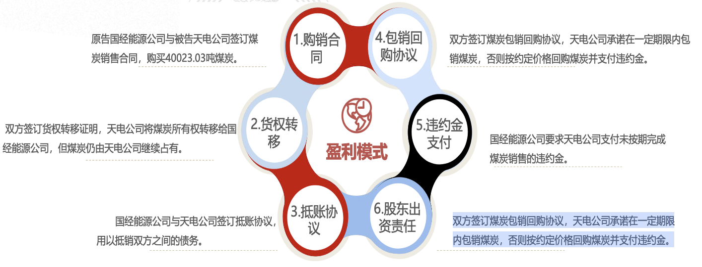

# 虚假贸易

在关联企业之间形成虚假贸易关系，形成一系列交易合同和单证，然后据此骗取银行或其他金融机构资金。在这种欺诈行为方式下，形式上看，的确存在着交易流（买卖）和（物流服务），也存在着不同的参与方或服务者，交易的单证和要素也是完整的。 但是实质上，所有的交易场景都是关联方假造出来，并没有真正意义上实质性的产业活动。

## 典型案例：大连机床骗贷案

2016年9月至11月间(违约之前)，大连机床等通过虚构应收账款、伪造合同和公章等方式，从中江信托“骗取”资金6亿元，或涉嫌经济犯罪。

大连机床公司因资金周转困难，负责向外融资，副总经理被告知，在进行融资时无论融资单位需要什么材料就想办法提供什么材料。

中介转达后与中江信托确定用大连机床营销与惠州比亚迪的应收账款债权向中江信托融资，但大连机床营销与惠州比亚迪只有600余万元的应收账款，达不到中江信托的融资条件。

于是用虚假的惠州比亚迪向大连机床营销采购3500台机床的《设备采购合同》。向金融机构贷款虚构应收账款7.833亿元，加盖之前伪造的“惠州比亚迪电子有限公司”合同专用印章。

# 重复质押

借款方凭借所形成的真实交易和资产从多方获得资金，加大了杠杆，放大了资金借贷风险。具体讲就是借款企业虽然有交易或物流业务，或者一定的资产， 但是由于目前不同金融机构或者供应链金融服务方之间难以做到信息共享，加之整个社会的统一信息、信用公示平台尚未建立，借款方运用自身的业务或资产从多方融资

## 典型案例：上海钢贸案

2012年8月集中开庭的上海钢贸诈骗案件中，多家银行将上海多家钢贸企业告上法庭，起诉案由多为“金融借款合同纠纷”。钢贸行业开具虚假仓单、重复质押获取银行贷款。
由于银行之间质押信息互不相通以及仓库管理存在漏洞，货主与仓储企业联合进行重复质押或者空单质押，一票多押甚至多次质押从银行融资。

# 自保自融

自保自融是针对贷方要求借款方担保、质押监管等要求作为获得资金前提的状况下，而虚构担保人或监管人，套取资金的做法。 通常自保自融是在从事供应链融资过程中亲属、朋友或者紧密关联人为借款企业进行担保，或者由同一人或关联人实际控制的物流仓储进行货物质押监管，套取资金。

## 典型案例：广东纸浆案

广州纸业4家公司在红岭创投的P2P平台借款1亿元。纸业融资项目的融资方，均为广东浆纸交易所会员，背后的实际控制人均为广州金山联纸业老板，项目通过物权转移的方式申请借款。

企业与仓库物流合伙犯罪，将货物重复抵押给银行进行骗贷，致使20余家银行牵涉同时广州纸贸危机还涉及到其他的民间借贷

在一笔3000万元的借款项目中，纸业公司将5000万元的纸制品物权转移至红岭创投，购买货物商业保险；红岭创投与物流公司签署仓储协议，担保方则签署回购合同为货物变现做保障。

实际控制人操纵手下企业，同时向7家银行和一些民间融资平台借款，利用机构间的信息不对称性，将同一批货物重复抵押骗贷。既自保自融也涉及重复虚假仓单。

# 重复虚假仓单

借款企业与仓储企业或相关人员恶意串通，以虚假开立或者重复开立的方式，就他人货物或者同一货物开立多张仓单，以供借款企业重复质押给不同金融机构获取大量仓单质押贷款，并从中牟取暴利。

## 典型案例：青岛港有色金属案

青岛港有色金属融资骗贷事件，祸起仓单重复质押。据了解，该过程并不复杂，操作要点就是保证参与方至少有三个，而且都是“自己人”。

A公司将一批货物以一定的价格卖给C公司，然后B公司再承诺以一个更高的价格买回。这样一来，C公司可以赚取其中的差价。其次，A公司需要叫仓储公司出具一张仓储仓单；

而C公司就要用这张仓单去银行进行抵押融资，将钱弄出来，加上一些自有资金，支付给A公司。B公司这个时候是货物的接收方，拿到货物后，可以再以一个协议价格卖回给A公司。

A此时又能再度让仓储公司重新开具一张仓单。一家公司就可以通过旗下不同子公司伙同仓储公司，对同一批货物开出多张仓单，然后到银行骗取质押贷款。

# 虚假贸易

资金的获取是凭借供应链中的业务或资产，但是筹集到资金后，资金的用途和去向并不是产业供应链，而是将资金投放到借款人博利的其他领域，诸如股市、房地产、理财等领域，甚至直接做“二银行”，放小贷，这样使得资金并没有真正进入产业供应链运营。

## 典型案例：2018年8月金银岛爆雷

金银岛资金链断裂，金联储爆雷，涉及投资者3万多人、圈走资金超25亿元。违约的资管计划和在违约路上的资管计划，涉及资金达到近40亿元。

但是，金银岛与金联储的十多个账户中，只有四五百万的资金。金联储资金最终流向为煤矿、焦炭、铁矿等仓单和债权，其中占比最大的是山西五个焦煤煤矿的煤炭仓单及债权，占比超过70%以上。

金联储爆雷最核心的问题是李逵变李鬼，供应链金融变信用贷。

金联储是金银岛产业互联网业务向个人的借款的金融平台，金联储资金投向的是资金链金融，而不是供应链金融，将供应链从企业端布局到个人端，利用互联网做个人借贷。

## “承兴系”供应链金融诈骗案

诺亚控股旗下的上海歌斐资产管理有限公司管理的若干债权基金投资了供应链应收账款。“承兴系”公司通过欺诈手段，将并不真实存在的应收账款进行转让。

罗静控制的承兴系公司和员工以非法占有为目的，利用其与京东、苏宁的供应链贸易背景，私刻两家公司印章，伪造合同，并通过采取冒充苏宁、京东员工身份、截留并伪造应收账款债权确认文书等方式，骗取多家单位财物。

承兴系公司先后与苏宁易购等开展供应链贸易，由承兴系公司垫资为苏宁易购开展采购业务。同期，承兴系公司在罗静、罗岚的安排下，利用其与京东公司、苏宁公司的供应链贸易背景，由罗岚私刻京东公司、苏宁公司印章。

分别由多名员工提供伪造的购销合同等融资所需材料，虚构应收账款，先后与某证券、信托等多家单位签订应收账款转让及回购协议等合同。让相关金融机构对虚构的应收账款信以为真，以此骗取融资款。

# 财务造假

企业财务造假的模式和目的主要包括：
1. 通过虚假的应收类款项虚增收入和资产规模；
2. 通过虚假应收类款项向关联方输送资金；
3. 与关联方配合以虚增公司所有者权益。以上三种模式之间的区别在于虚增的应收类款项的资金是否真实流出、是否回流企业并虚增利润、是否向关联方净输送资金以及是否通过回流虚增资本。

## 嘉兴银行遭供应链金融“连环雷”

美克斯机械公司与嘉兴银行海盐支行签订《最高额质押合同》，约定以价值1.14亿元的应收账款作为质物，对该公司最高限额1.14亿元的主债权提供担保，质物是某进出口公司购销合同项下的合同款和其他下游客户应收款。

美克斯机械公司未能按时偿还贷款，嘉兴银行于2017年12月6日向法院提起诉讼，法院判决确认银行对质押的应收账款享有优先受偿权。

2018年6月，美克斯机械公司申请破产重整，破产管理人对质押的应收账款提出异议。破产管理人指出，部分质押应收账款不存在，且新增质押发生在破产重整前一年内，请求法院撤销这部分质押。

美克斯机械公司与嘉兴银行签订质押合同，但其中涉及的部分应收账款并不存在或存在权利瑕疵。银行在放贷时虽进行了质押登记，但由于合同未实际履行等原因，导致质权受到挑战，面临追债困境。

# 教你如何识别应收类款项

# 造价模式

## 虚开采购发票

该模式下资金通过虚开采购发票等方式虚构经营性资金流出，资金流出体外被关联方挪用，而虚增的商品销售形成的营业收入以应收类款项形式体现，未形成经营性现金流入。典型表现为在营业收入和利润持续提升的同时，经营净现金流却依然有限，所经营业务难以为企业的运营提供有效资金。

## 虚假采购

在虚构经营活动、投资活动或筹资活动的资金流出后，通过虚假采购企业自身的产品流回体系内。这种模式先将资金通过虚开采购发票、虚构投资项目等方式流出，之后再通过中间公司、公司实际控制的关联方等购买企业商品方式将资金计入企业销售商品的经营性现金流入，达到虚增货币资金、营业收入，同时提升利润、改善现金流，可谓一举多得。典型表现是应收类款项多来自关联方或壳公司，关联交易频繁。

## 以经营采购名义虚假流出

为了配合股东的业绩需求和资金需求，公司股东以增资等名义对公司进行增资，之后部分资金再以经营采购名义虚假流出，或直接以其他应收款方式回流至原股东。较为隐蔽的方式是，股东以现金方式增资，资金先计入货币资金，之后部分资金真实用于采购营运资金，其余部分以虚构交易、虚开发票等形式流向资金中介并最终回流给股东。这种方式不仅虚增公司的资产和权益，同时能够满足股东的资金需求并优化股东的经营业绩表现。部分企业也存在反向操作，通过各类手段将资金输送给股东，股东以增资的方式流回企业。典型表现是其他应收款等应收类款项和所有者权益同时增长，企业并未有效增资

# 货权转移

1. 购销合同: 原告国经能源公司与被告天电公司签订煤炭销售合同，购买40023.03吨煤炭
2. 货权转移: 双方签订货权转移证明，天电公司将煤炭所有权转移给国经能源公司，但煤炭仍由天电公司继续占有。
3. 抵账协议: 国经能源公司与天电公司签订抵账协议，用以抵销双方之间的债务。
4. 包销回购协议: 双方签订煤炭包销回购协议，天电公司承诺在一定期限内包销煤炭，否则按约定价格回购煤炭并支付违约金。
5. 违约金支付: 国经能源公司要求天电公司支付未按期完成煤炭销售的违约金。
6. 股东出资责任: 双方签订煤炭包销回购协议，天电公司承诺在一定期限内包销煤炭，否则按约定价格回购煤炭并支付违约金。

法院认定煤炭销售合同、抵账协议、货权转移证明、包销回购协议有效，不支持原告增加违约金的请求。被告天电公司被判支付原告国经能源公司货款及违约金，驳回原告对被告玛纳斯发电公司的诉讼请求

# 出口退税

签订协议：原告贝文线缆公司与被告博深供应链公司签订了《供应链服务协议》，约定博深供应链公司为贝文线缆公司提供出口报关、代理物流运输、外汇收结、出口退税等外贸综合服务。
购销合同：双方签订了35份购销合同，总金额包含了13%的增值税，贝文线缆公司认为博深供应链公司尚有部分货款未支付。
出口退税：税务局认为贝文线缆公司出口的含金产品电缆存在出口退税风险，要求博深供应链公司返纳相关退税款。
诉讼仲裁：博深供应链公司向深圳国际仲裁院提起仲裁，要求贝文线缆公司偿还垫付的退税款及违约金等。深圳国际仲裁院支持了博深供应链公司的仲裁请求。

## 法院最终判决

法院认为贝文线缆公司所主张的款项实际上是增值税的一部分，因税务问题不能退税，博深供应链公司在仲裁中获得支持，贝文线缆公司需偿还垫付的退税款及违约金等。

# 债权优先

合同签订：天聚化工公司提供原材料，安宁合能公司生产钢材，国新联程公司负责销售，形成一个闭合的供应链循环
账户共管：为保障资金流的透明和循环贸易的顺利进行，天聚化工公司与国新联程公司、安宁盛诚公司分别签订了账户共管协议
资金流转：天聚化工公司通过共管账户向国新联程公司支付钢材款，然后资金流转至安宁盛诚公司，安宁盛诚公司再返还原料款给天聚化工公司
主要问题：天聚化工公司是否具备提起第三人撤销之诉的资格，同时是否对钢材款有优先回收的权利

## 法院最终判决

法院认为天聚化工公司未能提供充分证据证明其与原案诉讼标的具有法律上的利害关系，不具备提起第三人撤销之诉的主体资格，其债权不具有优先性。

# 增值税

合同签订: 供应链公司与通疆达海公司签订了《铝锭长单采购合同》，约定了铝锭的采购数量、价格、交付时间、货款支付及票据、违约责任等条款。
合同履行: 供应链公司按合同下达采购订单，要求通疆达海公司在规定时间内交付2000吨铝锭。通疆达海公司未能按时足额交付，仅交付995.6355吨，构成违约，供应链公司要求其支付违约金。
违约金争议:双方就违约金的数额发生争议，供应链公司要求的违约金高于通疆达海公司愿意支付的数额。
增值税发票: 通疆达海公司未向某某公司交付增值税专用发票，供应链公司要求其交付或赔偿因未交付产生的税额损失。

## 法院最终判决

法院支持供应链公司要求通疆达海公司交付增值税专用发票的请求，并支付的违约金为800000元，但对供应链公司要求的如不能交付应赔偿税额损失的请求不予支持。

# 货物留置权

物流合同: 立伟公司与金光公司及其关联方签订物流服务合同，提供华南地区的物流服务。捷亚通公司作为立伟公司的物流服务供应商。
运输合同: 捷亚通公司**与**和宇公司**签订航次运输合同，和宇公司将“临海288”轮出租给捷亚通公司，负责将纸浆从钦州港运输至洋浦港。
留置变卖: 因捷亚通公司拖欠和宇公司运费，和宇公司在货物运抵洋浦港后行使留置权，留置了案涉货物。- 和宇公司在留置货物后，与上海真略供应链管理有限公司签订销售合同，变卖了案涉货物。
损失赔偿: - 金光公司因货物灭失，要求立伟公司赔偿损失，并向上海仲裁委员会提起仲裁。- 上海仲裁委员会裁决立伟公司向金光公司赔偿货物损失及相关费用。

## 法院最终判决

认定和宇公司无权留置非债务人所有的货物，判决和宇公司赔偿立伟公司全部损失。

# 订单融资

签订合同: 甘某行嘉峪关分某行与某某公司签订了金融借款合同，涉及供应链金融中的订单融资业务。
应收账款质押: 某某公司将其对甘肃某公司的应收账款作为质押，以获得甘某行嘉峪关分某行的贷款。某某公司在贷款期间，除了部分逾期偿还情况外，基本按照合同约定正常偿还贷款。
资金监管账户: 根据《授信业务账户监管协议》，某某公司应将所有生产销售收入款项存入监管账户，甘某行嘉峪关分某行对这些账户进行监管。
违约问题: 甘某行嘉峪关分某行认为某某公司违反了《授信业务账户监管协议》和《最高额应收账款质押合同》，未将销售收入及质押的应收账款转入约定的监管账户，要求宣布贷款提前到期并要求某某公司等承担还款责任。

## 法院最终判决

法院认为甘某行嘉峪关分某行宣布贷款提前到期的格式条款无效，因为该条款加重了借款人的还款责任，显失公平。

# 代理采购

代理采购: 中国新能源公司代理北京智行鸿远公司采购电芯，向北京智行鸿远公司提供供应链金融支持。双方签订了《代理采购合同》，明确了采购产品的名称、规格、数量、金额及双方的权利义务。
购销合同: 北京智行鸿远公司向中国新能源公司供给核心零部件集成，即将电芯加工为电池包。中国新能源公司与北京智行鸿远公司签订了《购销合同》，约定了核心零部件集成的供应及整车生产交货事宜。
资金结算: 双方约定，电池包的购销款项直接冲减中国新能源公司前期垫付代理采购电芯的采购款，通过抵减方式进行结算。
违约责任: 北京智行鸿远公司未按约定支付保证金、采购成本及税费，构成违约，需承担相应的违约责任。

## 法院最终判决

判决北京智行鸿远公司支付电芯采购款、各项采购费用及资金成本，并支付律师费

# 融资租赁

融资租赁: 卓某金控公司与某某外事签订了《联合融资租赁委托服务合同》，约定由卓某金控公司为某某外事提供售后回租融资方式的融资租赁服务。
合同义务: 卓某金控公司负责设计融资方案，促成某某外事与主要出租方签订融资合同，并确保融资资金进入某某外事指定账户。
合同违约: 卓某金控公司认为某某外事未按合同约定支付联合租赁手续费，并私下与江苏某甲公司完成资金交易，构成违约。
违约责任: 若某某外事在与资金方签订合同后365日内私下与资金方达成资金交易，则构成违约，需支付联合租赁手续费及违约金。

## 法院最终判决

法院认为某某外事与江苏某甲公司签订了《融资租赁合同》和《买卖合同》，采取的是直租方式，与卓某金控公司推荐的售后回租方式不同，因此驳回了卓某金控公司的全部诉讼求。

# 资金拆借

循环买卖: 博德公司将货物售给中盐公司，中盐公司再将货物售给龙昊公司，最终博德公司回购货物。
合同签订: 中盐公司与博德公司签订了《产品销售合同书》，博德公司与龙昊公司、光大投资公司签订了《仓单管理协议》。合同中约定了货物的交付、货款的支付、回购义务等条款。
资金流转: 中盐公司向博德公司提供借款，博德公司将货物售给中盐公司，中盐公司将货物售给龙昊公司，博德公司最终回购货物并支付回购款。
责任认定: 博德公司作为借款人，收取了款项，应承担返还责任并支付利息。光大投资公司作为中间方，负责监督整个贸易流程并承担保证责任，同时向博德公司收取管理服务费。

## 法院最终判决

法院认定本案的法律关系为企业借贷关系，而非买卖关系。涉及的合同因违反金融法规的强制性规定而被认定无效。博德公司和光大投资公司未履行合同义务，构成违约，需承担相应的违约责任。

# 反担保 

1. 追偿权 易通达公司作为供应链金融服务提供方，对李彦鹏、潘友辉提起追偿权诉讼
2. 反担保抵押  李彦鹏申请再审，主张其与何逍然之间的抵押合同并非反担保合同，而是正常的借款抵押，且抵押期限已过，不应承担抵押担保责任。
3. 借款与保证关系 潘友辉主张已通过农业银行向易通达公司还款，不存在债权债务问题。同时，潘友辉认为实际借款人是李彦斌，且已向其归还部分款项。
4. 合同签订 涉案合同包括《借款咨询服务协议》、《借款协议书》和《保证合同》，潘友辉在再审期间提交了银行交易明细，用以证明其已向易通达公司归还涉案借款。
5. 关联企业交易 李彦鹏怀疑易通达公司、艾青松公司及其他相关企业之间存在关联关系，利用关联企业进行交易，存在不合理之处，怀疑涉嫌套路贷犯罪
6. 债权转让 何逍然将涉案债权转让给易通达公司，易通达公司据此主张追偿权

## 法院最终判决

法院再审认为，需要查实潘友辉是否已归还借款及李彦鹏的抵押合同是否构成反担保，以及李彦鹏是否应承担相应的法律责任。并将案件发回重审，以进一步查实相关事实。