# 民法典项下的应收账款类业务

1. 保理合同是“非典型担保合同”
2. 保理是哪种担保方式
3. 非典型保证担保/让与担保

无追索权保理尽管卖方通过无追索权保理规避了买方信用风险，但这并非得益于保理商承担了坏账担保责任，而是卖方通过将应收账款“卖断 ”给保理商实现的。显然，无追索权保理并不具备担保功能

在有追索权保理中，应收账款原债权人将应收账款债权转让至保理商名下，保理商在应收账款原债权人未返还保理融资款本息或者回购应收账款债权时，有权向应收账款债务人主张债权。对照前述让与担保的定义，有追保理仅有两点内容有待确认，一是应收账款转让是实质转让还是“形式上转移 ”，二是向应收账款债务人主张债权是否属于实现担保物权的行为

在应收账款账期届满或者发生保理合同约定的回购情形时，有追保理的保理商可以向应收账款债务人主张债权，也可以请求应收账款原债权人在保理融资款本息范围内付款或者回购应收账款债权。保理商为债权人，应收账款原债权人似乎可以看做连带责任保证人。

# 票据

票据是指出票人约定自己或委托付款人在见票时或指定的日期向收款人或持票人无条件支付一定金额并可流通转让的有价证券，包括支票、本票、银行汇票和商业汇票

- 标准化的合约——票据
- 专项的法律——票据法
- 统一的业务流程与会计处理制度
- 支票、本票、银行汇票为支付工具，商业汇票为支付和融资工具

## 票据行为四个特性

要式性：票据行为必须依照票据法的规定在票据上载明法定事项并交付
无因性：票据行为不因票据的基础关系无效或有瑕疵而受影响
文义性：票据行为的内容完全依据票据上记载的文义而定，即使其与实质关系的内容不一致，仍按票据上的记载而产生效力
独立性：票据上的各个票据行为各自独立发生效力，不因其他票据行为的无效或有瑕疵而受影响

# 电子票务

## 与应收账款比较 票据所具有的优势

| 优势体现 | 票据  | 应收账款（挂账）|
|----|----|----|
|权利行驶有保障| 特殊专项法律《票据法》保护| 基于《民法典》没有专项法|
|付款期限明确 | 付款期限为票据票面法定格式明确记载事项，到期日固定|付款期限在合同中约定 ，对债务人约束较弱 ，经常出现展期|
|权责关系明确 | 票据具有文义性的有价证券 ，法定格式固定 ，债权债务关系明确|付款内容基于合同不固定 ，债权债务有因性比较复杂。
|到期付款无条件 | 票据到期 ，承兑人当日足额付款 | 债权人被动 ，债务人具有抗辩权。有因性付款 ，容易出现纠纷|
|付款行为有约束| 如到期不能兑付，承兑人信誉受损，影响再次融资|存在继续拖欠的可能 ，付款约束弱|
|债权转让无需通知 | 票据可无限次自由背书转让 ，无需通知债务人 |债权每次转让必须经债务人确认|
|信用叠加流动性强 | 票据经手则担保 ，支持贴现转帖再贴|单一债务人信用 ，融资后流通很难|

## 应付款工具

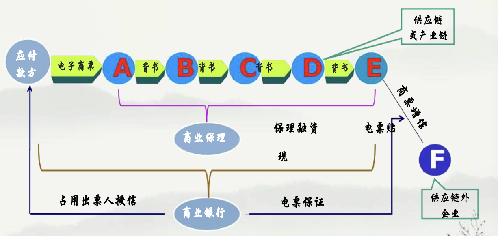

## 银行保贴业务

承兑人 当供应链核心企业为采购商时
持票人 当供应链核心企业为供货商时
背书人 当供应链中背书人为央企、国企、上市公司时
保证人 授信对象为控股型母公司，多个子公司为经营体时

## 针对不同需求 对不同对象授信

- 当供应链核心企业为采购商时,银行对商票承兑人授信,承兑人须为本行客户。若贴现申请人为非本行客户时,按银保监办发〔2018〕21号《关于规范银行业金融机构跨省票据业务的通知》办理。
- 当供应链核心企业为供货商时,银行对贴现申请人(持票人)授信。此时承兑人非本行客户, 银行须与贴现申请人签订协议,明确到期不获兑付时,贴现申请人承担被追索责任,先行兑付
- 当供应链核心企业为背书人时,银行对背书人授信，对背书人的直接后手持票人予以贴现。背书人通过受让后转出，无须承担融资成本，又实现应付账款出表处理，降低资产负债率，优化财务报表。因承兑人和持票人均非本行客户，银行须与背书人签订协议，明确到期不获兑付时,背书人承担被追索责任，先行兑付。此项授信对象多为央企、国企、上市公司
- 当多个子公司（承兑人）为采购商签发电子商票对外支付，控股母公司为承兑人的保证人时，银行对保证人（母公司）授信，对子公司（承兑人）的直接后手持票人予以贴现。此时承兑人和持票人均非本行客户，银行须与保证人签订协议，明确到期不获兑付时，保证人承担被追索责任，先行兑付

## 供应链电子商票保贴业务

授信对象：银行对承兑人授信

授信审核：承兑人与收款人的供应链关系

贴现审核：银行审核收款人是否为指定收款人 ，不再审核持票人交易背景

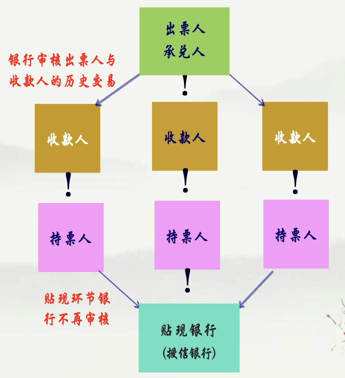

## 母公司出票人电票保贴业务

母公司为子公司增信,于公司对外支付

出票人: 承兑人(母公司) -> 收款人(子公司) -> 持票人(供应商) -> 贴现银行(授信银行)

授信对象: 银行对承兑人授信

授信审核: 承兑人的偿债能力 和子公司的生产性支付

贴现审核: 银行审核收款人与持票人的贸易背景 (含同、发票)

## 子公司出票人电票保贴业务

子公司为出票人，母公司为承兑人，供应商为收款人，持票向银行贴现

授信对象：银行对承兑人授信

授信审核：承兑人的偿债能力和子公司与后手的交易背景

贴现审核：银行审核收款人与出票人（前手）的贸易背景（合同 、发票）

出票人: 承兑人(子公司) -> 收款人(母公司) -> 持票人(供应商) -> 贴现银行(授信银行)

## 后贸易背景电票保贴业务

母公司为出票人和承兑人,供应商为收款人,贴现后向供应商支付货款

授信对象：银行对承兑人授信

授信审核：承兑人的偿债能力和子公司的生产性支付

贴现审核：银行审核收款人与后手（供应商）的贸易背景（合同、发票）后，受托支付

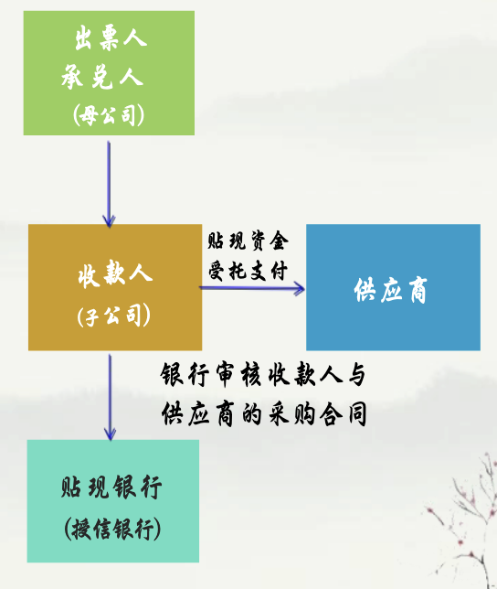

## 总分包工程项目融资

业务场景：三方交易，资金两方直达，确保分包商及时收款

授信对象：银行对承兑人（发包方）授信

贴现审核：银行审核总包方（出票人）与分包商的贸易背景（分包合同与发票）

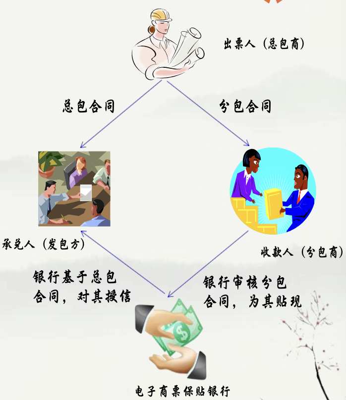

## 供应链代采支付融资

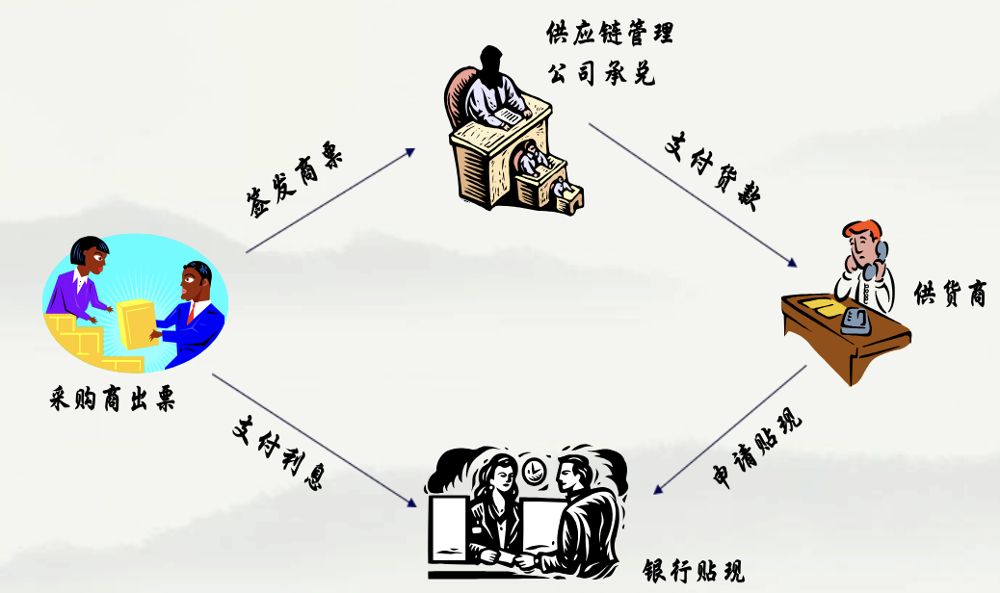

# 商业汇票

## 商业汇票特点

商业汇票按承兑人分为商业承兑汇票和银行承兑汇票、财务公司承兑汇票。
商业汇票按介质不同分为电子商业汇票和纸质商业汇票。
商业承兑汇票由银行、财务公司以外的付款人承兑。
银行承兑汇票由银行承兑，财务公司承兑汇票由财务公司承兑。
商业汇票当事人： 出票人，承兑人，收款人，背书人，保证人。
商业汇票的付款人为承兑人。
商业汇票付款期限， 自出票日起最长不得超过6个月

## 针对不同业务场景 电子商业汇票的承兑方式

### 电子商业汇票分为四种类型：

电子银行承兑汇票、 电子财务公司承兑汇票、 电子商业承兑汇票、供应链票据。

### 商业汇票承兑分为四种方式：

一、真实交易关系或债权债务关系中的债务人签发并承兑；
二、真实交易关系或债权债务关系中的债务人签发，交由第三人承兑；
三、第三人签发，交由真实交易关系或债权债务关系中的债务人承兑；
四、收款人签发，交由真实交易关系或债权债务关系中的债务人承兑。

### 电子商业汇票贴现授信分为四类对象：

承兑人、背书人、保证人、持票人（ 贴现申请人）

## 银行受理商业保理电子商业汇票贴现的合规政策

商业保理的标的：供货商与采购商的应收账款。
电子商业汇票可以作为应收账款的债权凭证。
商业保理公司为类金融机构，具有放贷经营许可，其在融资项下受让电子商业汇票与前手构成债权债务关系。
《商业保理管理办法》商业保理企业可以通过银行和非银行金融机构以及发行债券等渠道融资。
央行《电子商业汇业务管理办法》持票人可提供与直接前手间债权债务关系的合同、发票等其他材料，向银行申请贴现。
商业保理公司获得票据权利，须就该电子商业汇票项下的保理融资款确已支付予直接前手。
银行可在授信项下，对应收账款债务人为出票人、商业保理公司为承兑人，供应商为持票人的电票予以贴现

## 针对不同需求 对不同对象授信

当供应链核心企业为采购商时，银行对商票承兑人授信，承兑人须为本行客户。若贴现申请人为非本行客户时，按银保监办发〔2018〕21号《关于规范银行业金融机构跨省票据业务的通知》办理。

当供应链核心企业为供货商时，银行对贴现申请人（持票人）授信。此时承兑人非本行客户，银行须与贴现申请人签订协议，明确到期不获兑付时，贴现申请人承担被追索责任，先行兑付

当供应链核心企业为背书人时，银行对背书人授信，对背书人的直接后手持票人予以贴现。背书人通过受让后转出，无须承担融资成本，又实现应付账款出表处理，降低资产负债率，优化财务报表。 因承兑人和持票人均非本行客户，银行须与背书人签订协议，明确到期不获兑付时, 背书人承担被追索责任，先行兑付。此项授信对象多为央企、国企、上市公司。

当多个子公司（承兑人）为采购商签发电子商票对外支付，控股母公司为承兑人的保证人时，银行对保证（母公司）授信，对子公司（承兑人）的直接后手持票人予以贴现。此时承兑人和持票人均非本行客户，银行须与保证人签订协议，明确到期不获兑付时，保证人承担被追索责任，先行兑付

## 收款人为核心企业电子商业汇票服务供应链企业

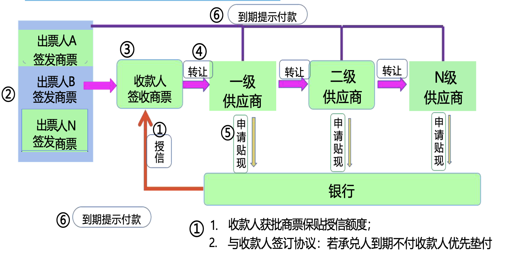

## 持票人可对所有前手行使追索权

> 提示：质权人不能被追索

根据《票据法》
- 第六十八条 汇票的出票人、背书人、承兑人和保证人对持票人承担连带责任
- 持票人可以不按照汇票债务人的先后顺序 ， 对其中任何一人、 数人或者全体行使追索权
- 持票人对汇票债务人中的一人或者数人已经进行追索的，对其他汇票债务人仍可以行使追索权。被追索人清偿债务后，与持票人享有同一权利

根据《票据法》第13条第1款, 票据的债务人不得以自己与出票人或持票人的前手之间的抗辩事由对抗持票人

《最高人民法院关于审理票据纠纷案件若干问题的规定》第十三条票据债务人以票据法第十条、 第二十一条的规定为由，对业经背书转让票据的持票人进行抗辩的, 人民法院不予支持

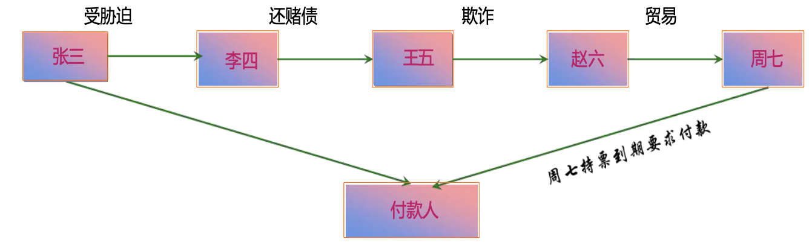

## 商业汇票当事人

- 债权人：收款人或持票人
- 债务人：
  - 主债务人：承兑人
  - 次债务人：出票人、背书人、保证人

第一种权利：向主债务人行使付款请求权；
第二种权利：向次债务人行使追索权；
第三种权利：民事权利利益返还请求权 ，诉讼时效内且只能向出票人和承兑人

## 法院关于审理票据纠纷案件若干问题的规定

第六十二条人民法院审理票据纠纷案件，适用票据法的规定；票据法没有规定的，适用《中华人民共和国民法典》等法律以及国务院制定的行政法规。
中国人民银行制定并公布施行的有关行政规章与法律、行政法规不抵触的，可以参照适用。
第六条 因票据权利纠纷提起的诉讼，依法由票据支付地或者被告住所地人民法院管辖。

票据支付地是指票据上载明的付款地，票据上未载明付款地的，汇票付款人或者代理付款人的营业场所、住所或者经常居住地，本票出票人的营业场所，支票付款人或者代理付款人的营业场所所在地为票据付款地。代理付款人即付款人的委托代理人，是指根据付款人的委托代为支付票据金额的银行、信用合作社等金融机构

## 背书人对后手承担保证责任

《票据法》第三十七条 背书人以背书转让汇票后 ， 即承担保证其后手所持汇票承兑和付款的责任。背书人在汇票得不到承兑或者付款时，应当向持票人清偿本法第七十条、第七十一条规定的金额和费用。

第七十条 持票人行使追索权，可以请求被追索人支付下列金额和费用：
- 被拒绝付款的汇票金额
- 汇票金额自到期日或者提示付款日起至清偿日止，按照中国人民银行规定的利率计算的利息
- 取得有关拒绝证明和发出通知书的费用

被追索人清偿债务时，持票人应当交出汇票和有关拒绝证明，并出具所收到利息和费用的收据

警示： 
1. 不是所有票据都可以背书
2. 商承签收后回背承兑人
3. 追索金额可以大于票面金额

## 票据质押贷

持票企业向贸易公司提交融资申请
贸易公司收取融资服务费通知银行放款

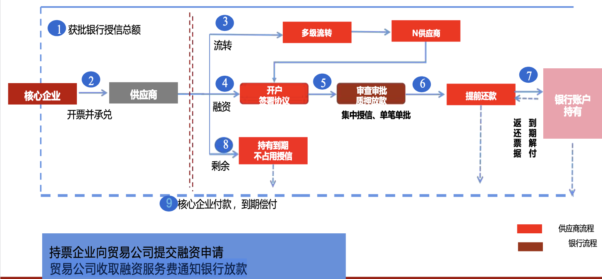

## 商票供应链融资

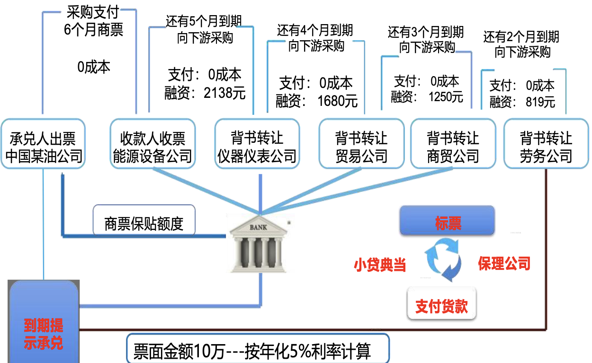

## 社会公众开放

> 如输入名称后未查询到承兑人，说明没注册

票据承兑信息查询：输入票据（包）号码查询已披露的票据主要要素信息。查询到票据主要要素信息后 ，可点击详情页面的“打印”按钮打印查询结果

承兑人信用信息查询：输入承兑人名称或统一社会信用代码，筛选时点日期，查询已披露的承兑人信用信息。查询到票据承兑人信用信息后，可点击详情页面的 “打印”按钮打印查询结果

## 受托支付或买方付息贴现

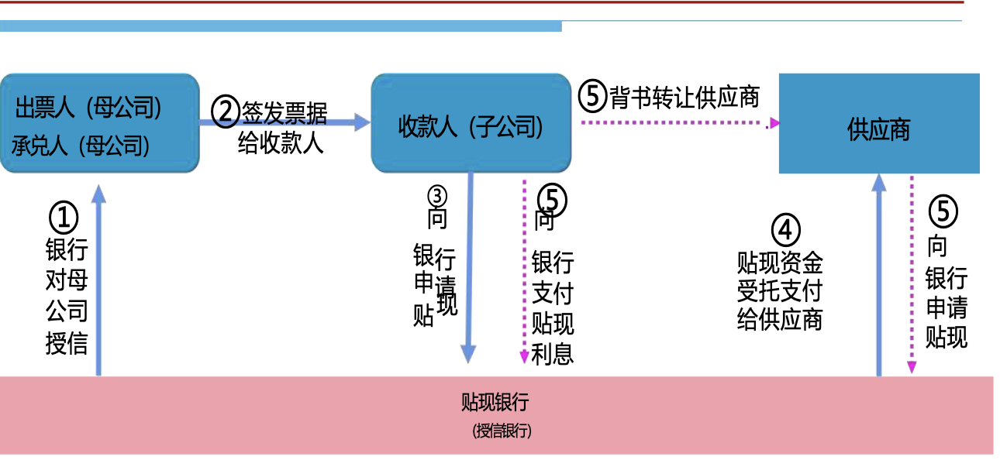

银行对承兑人授信，审核承兑人的偿债能力和子公司的贸易交易支付。
贴现时银行重点审核收款人与后手（供应商） 的贸易背景（合同、发票）后 ，受托支付。
⑤收款人背书转让供应商，收款人付息供应商申请贴现

## 担保公司与租赁公司商票保贴业务

- 租赁公司业务背景真实、用款需求大
- 与租赁公司开展商票保贴/贴现业务，可有效促担保公司盘活闲置授信额度，获得租赁供应商客户，带动信贷投放、营收批量快速增长

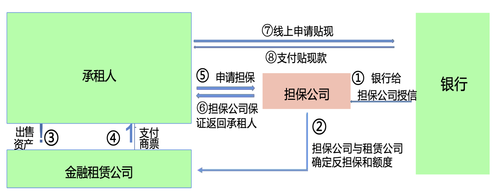

# 保证责任

《民法典》第六百八十六条 当事人在保证合同中对保证方式没有约定或者约定不明确的 ， 按照一般保证承担保证责任

A借500万给B，而C给B担保

连带保证: A可以向B和C两个一起要钱
一般保证: A只能在告B之后 ，且B还不了钱情况下 ，找C

# 资本新规《表外信用风险加权资产计算表》

| 项目 | 信用转换系数 |
| --- | --- |
| 1. 等同于贷款的授信业务 | 100% |
| 2. 承诺 |  |
| 2.1 可随时无条件撤销的贷款承诺 | 10% |
| 2.2其他贷款承诺 | 40% |
| 2.3 未使用的信用卡授信额度 |  |
| 2.3.1 一般未使用额度 | 40% |
| 2.3.2 符合标准的未使用额度 | 20% |
| 2.4 票据发行便利 | 50% |
| 2.5 循环认购便利 | 50% |
| 2.6其他承诺 | 40% |
| 3. 银行借出的证券或用作抵押物的证券 | 100% |
| 4. 与贸易直接相关的短期或长期项目 |  |
| 4.1 基于服务贸易的国内信用证 | 50% |
| 4.2 其他与贸易直接相关的短期或长期项目 | 20% |
| 5. 与交易直接相关的或长期项目 | 50% |
| 6. 信用风险仍在银行的资产销售与购买协议 | 100% |
| 7. 远期资产购买、远期定期存款、部分交款的股票及证券 | 100% |
| 8. 其他表外项目 | 100% |

## 表外项目信用转换系数

(一) 等同于贷款的授信业务。 包括一般负债担保、承兑汇票、 具有承兑性质的背书及融资性保 函等。

(四) 与贸易直接相关的短期或长期项目。主要指有优先索偿权的装运货物作抵押的跟单信用证

(五) 与交易直接相关的或长期项目,包括投标保函、履约保函、预付保函、预留金保函等