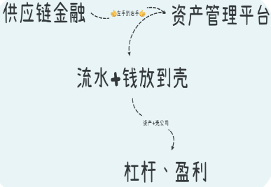
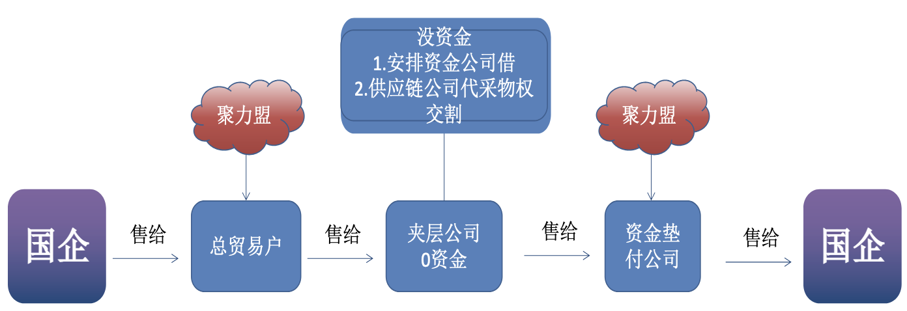
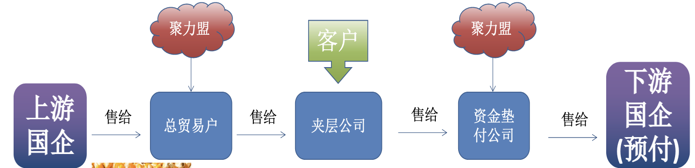
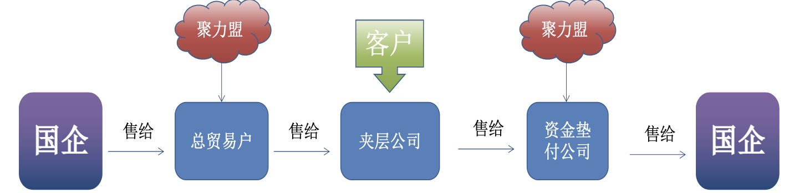
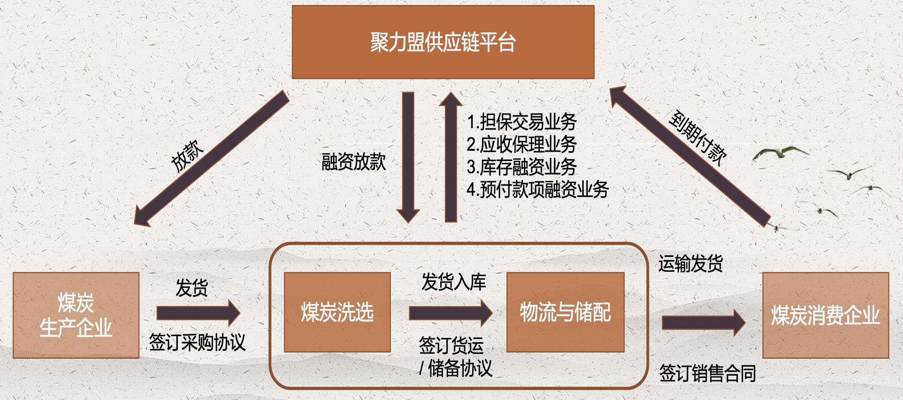
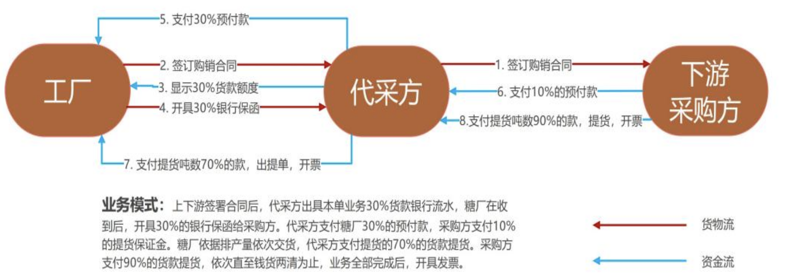
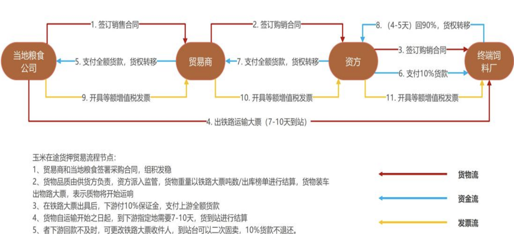

# 未来展望

第一步，通过贸易创造本金，俗称无中生有
第二步，通过贸易制造优质主体，覆盖融资成本
第三步，通过过桥资金，给优质主体装入资产
第四步，通过资产收益完成闭环

未来的聚力盟，人均可支配流动资金超过1000万，我们这一群人，会通过内部孵化的方式，扶持圈子里的项目（流量赋能、资金赋能）全国各地我们都有可控的优质主体，就这一点就是无人能比的

## 聚力盟1.0

通过优质贸易链条；
优化企业经营数据；
拿到第一桶金

## 聚力盟2.0

挖掘分公司自身资源；
扶持分公司以及有资源的合伙人；
成立独立贸易链；
与全国至少10家平台公司深度合作

每个人身边都或多或少有一定资源，落不了地，供应链的打法可以深度与缺钱的国企合作。

随着金交所落幕，大量定融产品没办法借新还旧，且未来国资供应链受到厦门的牵连，必然会暂停一段时间，这是我们的机会

## 聚力盟3.0

产融结合,未来会与优质分公司并表，在当地成立产融会客厅，与深度合作的平台公司合作产业发展中心，产业金融生态圈，金融赋能中心等等

趁着退金令的窗口期，赶紧与各地能联系到的国企取得联系，说实话，我们民营企业需要他们的背书

## 聚力盟4.0

新质生产力,内部生态圈。

下行周期总会过去，该抄底的时候绝不含糊，聚力盟总部为核心单位，作为流量入口，业务前台负责梳理筛选各位合伙人自荐的项目

未来我们这个小圈子，左手有项目，右手有资金。左手供应链管理平台，右手资产管理平台。

且全国多地布点，各地未来都可以做项目沙龙，做路演，我们各位生态圈的成员，可以以投资人的身份共同参与圈子里的项目，为各位的优质项目解决缺资金缺资源缺人脉的问题

# 品牌化

跟随政策，做好产融结合

搭建“票、证、融、贷、债、险、租”的供应链金融产品与解决方案体系

# 优质供应链分享

## 天然气

### LNG液化气体

上游：我们与某石油等国企或合资企业进行招投标，开户或者打预付购买
下游：加气站，玻璃厂，食品加工厂，城燃{城市供暖}

### CNG压缩天然气

上游：从某油天然气股份有限公司管道输油气分公司名下的三产公司招标成功后加工并销售CNG
下游：加工为成品CNG后再销售给某油天然气股份有限公司管道输油气分公司名下的三产公司

## 煤炭

### 商品煤-粉煤

上游：煤矿、洗煤厂等，国营为主，私营为辅；主要供应电厂、钢厂）多为私营，无需保证金，无需预付款
下游：电厂、站台、钢厂、水泥厂、焦化厂等，电厂十天左右招标一次，投标需打保证金（20-30万）；大量煤炭供应到站台后转运到煤炭输出港，优点是量大

# 资产管理

稳定的贸易可以带来相对的利润，这一部分利润除了可以抵扣税务成本，银行贷款利息成本，还有盈余，最重要的是-资产管理

## LNG

1. 2024年通过更大资金体量，拥有更大该价权，以更低的价格购入LNG
2. 以优惠价整合更多中间商，增大销售体量，获取更多利润

## CNG

1. 签订更多井口气加工，拥有更大体量。
2. 签订井口气销售合同，以高于中石油回收价售予市场，获取更多利润

2024年预计收购（或租赁）20家以上加气站，以此自产自销LNG与CNG，增大自有体量，赋能更多孵化企业

# 赋能服务

## 壹合自媒体公司 - 教你做抖音

给老板打造IP - 用P对接产品

## 圣代企服公司 - 提供金融服务

解决资金问题？

- 跟银行端对接
- 融资租赁段对接
- 保理端对接

## 聚力盟法务部门 - 提供法律服务

法务风险怎么解决？
- 代采合同怎么开？
- 独立产品有什么特性？

## 聚力盟提供财税公司 - 聚力盟帮你解决

实操问题？

- 同一IP开票？
- 利润怎么解决？
- 本金怎么解决？
- 回流怎么解决？

## 子公司：顺顺助融

第一步抓取税务数据，做到夹层企业穿透，做好融资底层逻辑
第二部抓取物流数据，做到供应链金融的可视化数据。

物流企业通过物流活动参与到供应链运作中，通过整合供应链中的物流仓储网络，运输网络，配送网络，链接资金提供方，为服务对象提供融资解决方案和资金支持服务，并协同资金端进行风控

- 掌控实体流动，可以动态监管
- 掌控仓储网络，可以静态监管
- 部分企业具有平台，掌控数据信息

# 解决初始资金问题方法

重点：为什么要拆分出去一家供应链管理平台公司，避免资金回流造成的法律风险同时一定要让他成为核心企业

> 资金不能过夜，银行必冻结

# 解决开票额度不够的问题

> 资金不能过夜，就是不能出额

1. 不要养白户，不要做0——1
2. 实在要开票额的话，让夹层公司，直接跟下游国企签合同，拿着合同，和过往公司经营数据，去专管员处提额，通常专管员提不了，让他“引荐”分管副所长

注意：还有一种不常用的方法，更改国企合同里面支付账户

# 解决没有经营范围

没有食品经营许可证，也可以做食品贸易！

# 煤炭贸易链

煤炭产业链主要有六大环节：原煤生产、煤炭洗选、煤炭储配、铁运物流以及能源贸易。

即煤炭出厂——洗涤厂进行筛选与提炼——发至货运站/储备后配货发货——下游需求厂商。

在此期间，贸易商会对有应付预付需求

此时，煤炭供应链融资，也可以称为炭供应链金融，通过担保交易、应收保理、库存融资、预付款项融资等维度切入，盘活应收账款，用少量的资金进行大量操作，用煤炭资产进行资金盘活。

同时，在金融服务中，赚取煤炭洗配、煤炭物流货运、贸易溢价差、代采服务费、资金垫付利息等收入

上游代采:
1. 煤炭贸易商(乙方)出X%自有资金，供应链金融机构(丙方)出资X%，上游需要是国央企煤源公司
2. 供应链金融机构先和下游电厂签约，再和项目公司签订背对背的煤炭购货合同
3. 贸易商先付款X%向供应链金融机构买货，供应链金融机构再向上游打款
4. 下游付清全款接货

下游托盘:
1. 煤炭贸易商(乙方)和煤炭需求方国有电厂(五大电六小电)(甲方)，沟通好煤炭的买卖供货合同，约定双方的权利义务，比如，价格、账期、付款比例
2. 供应链金融机构(丙方)先和国有电厂签订煤炭购货合同，然后供应链金融机构再和煤炭贸易商，签订同样的背对背煤炭购货合同。煤炭贸易商向国有电厂供煤炭，供应链金融机构向煤炭贸易商同步结算煤炭货款
3. 然后，国有电厂按照账期向供应链金融机构拨付煤炭的货款

全托模式:
1. 煤炭贸易商(乙方)出X%自有资金，供应链金融机构(丙方)出资X%；
2. 供应链金融机构和下游五大电六小电厂签合同，在上游完成装车后，供应链金融机构出X%。货到下游后，按开票和下游结款时间完成整体付款

## 风险控制

煤炭供应链金融是基于煤炭上中下游企业建立信用关系，将外部资金引入煤炭流通业中，让“商流、物流、资金流、信息流”形成闭环，提高效率，加速周转

原煤生产 -> 煤炭优选 -> 煤炭储配 -> 铁运物流 -> 下游消费

第一，运营权决定煤的归属权，控制入库出库，就等同于控制了股权
第二，银行审计来查你？做供应链金融，要合法、合规、合理，一个最基本的基石，做贸易的时候，看过货吗？看货有没有留痕?
第三，签合同进行价格锁定后端煤炭储备，会出现有人偷煤，抢煤，都不能雇保安，保安给一条烟就放人进去了，或者直接抢煤，现在哪还有人民群众的利益勇斗歹徒？谁卖命啊，靠不住，只能派自己人守着

> 市场上出现的大多数夹层很多的那种，不要去做！！空转的那么多，一条贸易链，穿插几十上百个夹层；
> 有货出问题是违规，无论是构造贸易还是融资贸易；没货出问题就是违法

### 方法

- 通过派驻专人驻场跟单、监管仓库，对货物化验、仓储、交收、物流全程监控，确保每笔煤炭供应链业务款项的真实及准确性
- 基于煤炭站台、洗煤配煤厂、仓储货运站资源提升资产可控性，站台收到煤炭货权后支付预付款，下游客户验收后支付尾款，保障对煤炭资产的全过程控制权
- 下游不回款怎么？ 下游先打预付款30%解决这个问题，如果下游出现问题，我们就平仓，货权是控制在我们手上的，这是关键中的关键！

# 其他风险的把控

举个例子？存货存在的问题，押品到底都是啥，你看见的那个东西你认识吗？羊绒和羊毛你分得出来吗？燃料油、汽油、煤油衍生品你分得出来吗？你认识吗？

无论你用任何大宗商品，一年的价格波动百分之三五十很正常。价格跌了，让企业补货或者还贷款，价格高了多给企业放钱。你需要有一个人专门能去看着这个货物的价格，随时价格波动，随时调整你的抵押率

押品质量不明白，进了一堆焦炭，焦炭最核心的是热值，含硫量，该去检验检验，该去测试测试，最害怕是假货。

2013年平安银行，10万吨煤，几十米高的煤山好几个，到处置的时候，只有外边表层的一层是没底头圈石头。从那天开始，做货押的客户经理都学会了开铲车，我们的人去验货的时候也是先把铲车开去，从那个煤山挖到煤山里头，再去验这货怎么样

保险必须上得齐。一批商品运进来，在海上的时候有水险，到了陆地上有陆险

但是各位有没有讨论考虑个问题？这个东西从船上运下来到你货堆场里面，中间出问题了怎么办？保险体系里头叫水陆路运输险，那个东西很多人不上，你这批货运的过程中光让别的车撞了，没有人保你，所以什么完整的货物保险体系在做供应链也是非常需要的

# 代采业务流程

业务模式: 上下游签署合同后，代采方出具本单业务30%货款银行流水，糖厂在收到后，开具30%的银行保函给采购方。代采方支付糖厂30%的预付款，采购方支付10%的提货保证金。糖厂依据排产量依次交货，代采方支付提货的70%的货款提货。采购方支付90%的货款提货，依次直至钱货两清为止，业务全部完成后，开具发票。

# 玉米业务流程

玉米在途货押贸易流程节点：
1. 贸易商和当地签署采购合同，组织发货
2. 货物品质由供货方负责,资方派入监管，货物重量以铁路大票吨数/出库情单进行结算，货物装车，拿出铁路运输大票，表示货物将开始运输
3. 在铁路大票出具后，下游付10%保证金，支付上游全额货款
4. 货物自运输开始之日起，到下游指定地需要7-10天，货到站进行结算
5. 若下游回款不及时，可更改铁路大票收件人，到站台可以二次售卖，10%货款不退还