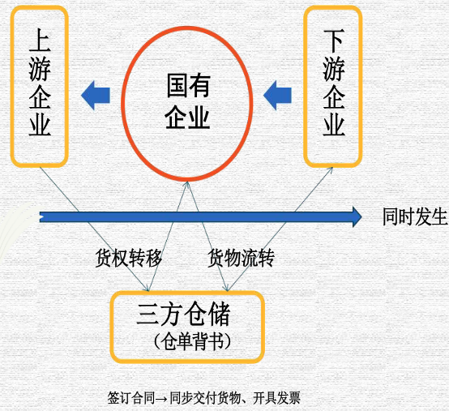
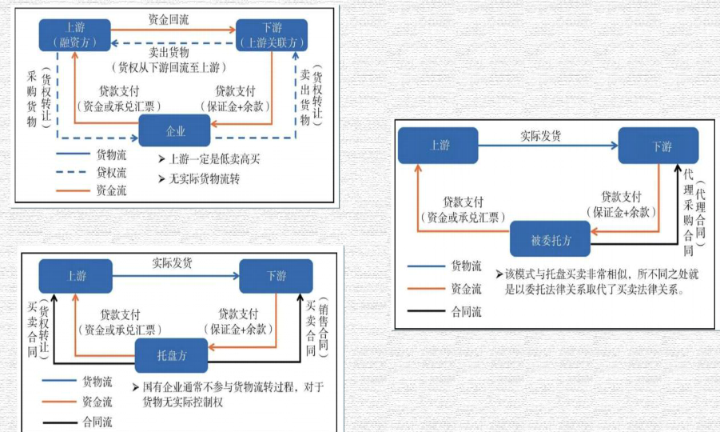
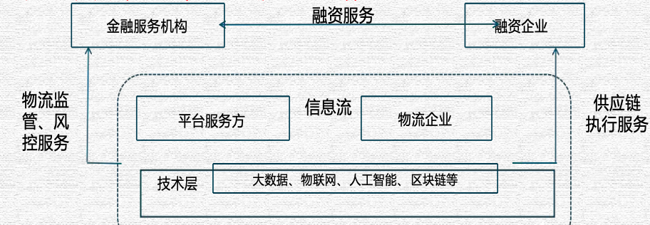
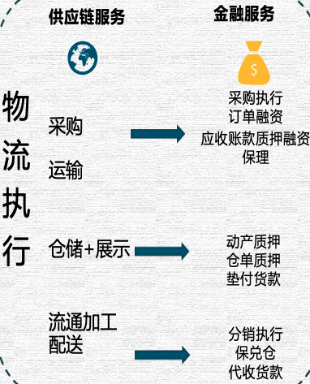

# 真实贸易,究竟什么才算是真实贸易

1. 上游供应商最好不是下游客户指定
2. 上游供应商及下游客户不能关联
3. 深度参与物流,货物需要流转
4. 上下游最好有一方是TOC端
5. 上下游合同独立
6. 最好是基于长期协议项下的单笔协议
7. 价格条款内容充足有效
8. 合同中无代理、代管、代销、垫资等可能引起歧义字样
9. 合同条款中关于商品价格不能以时间作为计价方式
10. 明确不对货物负责是不行的

# 银行眼里的交易背景真实性

- 合理性 结合贸易合同,分析各交易主体风险承担情况,业务是否和公司业务相关,毛利率是否合理,是否符合会计准则规定。一般而言,融资性贸易等变形贸易往往毛利率低,不承担存货风险,没有定价权, 且和公司主业无关、通常也不实际参与实物流转。

- 资金流转 资金来源是否异常,是否和银行借款匹配,是否承担客户的信用风险,收付款是否真实正常。一般而 言,从事融资性贸易等变形贸易的公司在往存在银行借款等资金渠道。

- 货物流转 核实货物流势是否真实,核实物流运输的细节,实物会付购和布,是否由公司真实参与,原始单据是否真实,是否证明交易的真实性,实务控制权的转移是否表明公司采担了存货风险。 绝不能不参与实物流转,管不好实物,不承担运输,只靠着合同、发票、提单等形式资料 "做业务"

- 选择交易主体 关注上下游的变易直体是否有经营资质和热力,是否有关联关系,查询公开信息,关注是否落在异常 的工商信息,比由温州地址接近,同一个电话等。

# 基于银行授信构建供应链场景

# 融资型贸易 贸易型融资

- 完全不参与实物流转,买卖仓单或提单等货权转移证明,实质上系资权转移证明做质押,提供资金借贷,收取利息,体现为贸易利润;

- 参与实物流转。贸易商一般会根据客户指定的采购内容,向供应商采购商品,销售给客户,实质上仍然是资金托盘,贸易商不承担与商品转移相关的风险,仅收取固定的利润,商品价格波动并不会影响贸易商的利润。融资性贸易披着贸易的外衣,实际从事资金借贷,变相承担了类似银行的功能,但不受直接金融监管。

## 贸易型融资

这里的贸易背景实质真实性,应包括四个方面的内容;

意图应具有真实性——即以贸易下商品交换实现收益作為基础变易的目的。

货物应具有真实性——贸易融资下掌管货物或货权, 即意味获得融资的风险缓释工具； 处置货物

## 融资型贸易

从真融资假贸易到走单、走票、不走货

买卖关系是假, 利用这种基础交易达到融资才是其真实的目。在这种模式下, 参与方有三方,银行, 买方 (资金需求方), 卖方 (往往资信良好, 同时也承担买方的还款担保)。三方约定, 银行将购货款给卖方, 买方向银行申请提贷，银行向卖方指令放贷。这种模式下，没有真实的货物交易，仅仅是通过这种方式, 买方得到了融资款, 卖方收取相应的中间费, 银行收取了利息和手续费, 如果顺利, 各方所需均能满足, 一旦买方无力还款, 银行将依照三方合同,起诉买卖双方, 在这种情况下, 卖方的“亲手铜” 往程是主张没有真实的交易, 三方协议是虚假的意思表示而无效。那么卖方的抗辩能否得到法院支持? 银行的主张能否得到法院的支持?

# 供应链金融风险的核心---交易背景真实性

# 银行账里的表面真实性---背景审核要点

1、仓单，对仓单出具人的专业资质进行严格把关，确认其是否满足行业的准入标准。此外，通过电话查询、对仓储单位进行实地考察，或通过系统对接等多元化手段来进行核实。对于大额仓单，应亲临仓库指定货位进行现场查验，以确保货物的真实存在。同时，必须警惕并防范仓单被无理注销的风险。在处理连续背书的仓单时，需追溯所有前手背书人，从而严格核实贸易背景的真实性。

2、增值税专用发票，首先应对票面的完备性进行仔细的检查。这包括但不限于确认发票上的各个项目是否均已详尽填写, 各联次的内容和金额是否保持一致, 以及书写是否清晰、有无涂改现象。开票日期通常不应早于合同和实际的发货日期。同时, 买卖双方的单位名称必须与合同上的信息相符。此外, 发票上的货物名称和单价也应与合同中的条款相吻合。在单单相符方面, 增值税发票的向容必须与商业发票和货运单据等文件保持一致。

3、关联交易，深入剖析关联公司间的实质控制关系和利益分配格局；详尽审查关联公司间近几年的贸易往来记录, 探究其交易模式及商品的变更情况，并评估这些变更的合理性；严格审视关联交易的商业逻辑与合理性, 特别关注各公司在生产，加工环节的角色与合作模式以及贸易型企业在采购与销售中的功能; 清晰追踪产供销各环节的货物与资金流向; 确保交易价格符合市场公允标准; 核查融资期限是否符合行业常视, 是否在异常延长; 警惕涉及大额贸易融资、大宗商品妥易或热门商品的交易; 验证结算单据的完整性与真实性; 根据具体交易情况, 深入挖据其他潜在风险点。

# 审计眼里的交易背景真实性

> 如果合作方是平台公司,需要意的就是审计

《关于进一步和强中央企业大宗商品经营业务风险防范有关事项的紧急通知》(图资厅发评价 2013 31号)
《国务院国有资产监督管理委员会国资评价 [2014] 1200号》
《关于进一步排查中央企业融资性贸易业务风险的通知》《国资财营 [2017] 652号》
《关于做好2023年中央企业违规经营投资责任追究工作的通知》 
《关于视范中央企业贸易管理 严禁各类虚假贸易的通知》 
《关于加强地方国有企业债务风险管控工作的指导意见》 
北京注册会计师协会专业技术委员会专家提示【2023】第4号

从中央角度认为融资性贸易业务是以贸易业务为名，实为出借资金、无商业实质的违规业务。 

主要特征有：
- 虚构贸易背景，成人为增加交易环节
- 上游供应商和下游客户均为同一实际控制人控制，或上下游之间存在特定利益关系
- 贸易标的由对方实质控制
- 直接提供资金或通过结算票据、办理保理、增信支持等方式变相提供资金

“空转”“走单”业务是指贸易行为缺乏真实性和实质性，加入交易环节不具有商业理由，通过反复交易、循环周转等方式虚构贸易行为进行套利，率质是虚假贸易。 

核心是：即使存在货物的交付，如果各方真实目的系融资，也可能在国货监管层面定性为融资性贸易。 

人民银行会同工业和信息化部等部要出台的《关于规范发展供应链金融 支持供应链产业链稳定循环和优化升级的意见》支持供应链金融业务的开展，融资性贸易和供应链金融的本质区别。

## 四大主要间题

1. 虚构贸易背景，或人为增加交易环节
2. 上游供应商和下游客户均为同一实际控制人控制，或上下游之间存在特定利益关系
3. 贸易标的由对方实质控制
4. 直接提供资金或通过结算票据、办理保理、增信支持等方式变相提供资金

## 识别手段

1. 详细分析交易背景及商业实质
2. 检查采购和销售合同是否存在异常条款或者合同签订流程中的异常情形
3. 检查交易各方是否存在关联方关系或密切业务往来关系
4. 检查收款和付款管理
5. 检查是否具有真实的货物流转

## 审计的注意点

务必注意物流监控，运输费用的记录，结合销售和采购合同中对于运输义务的约定，分析运输费用的发生是否与交易规模相匹配； 资运物流单中经办人、承运人、收货人是否签字齐全，时间前后连续

主要的代理运输公司业务人员，是否了解其运输业务的详情，货物发运规模，运输方式，运费结算，主要发货和到货地点等信息

对期末存货无余额但报告期变易额重大的情况，可以考虑对列支的仓储费、过户费等执行分析程序，对比这些费用支出与变易金额是否配比

对于进出口货物，检查海关单据，如有必要可考虑前往海关申请获取有关进出口货物数据的证明或通过向海关发送函证获得上述数据，如有可能地可使用中国电子口岸网络数据平台，查询进出口货物的数据，但当使用该网络查询方式时 注册会计师应当评估被审计单位网络环境的可信赖性以及验证网络查询过程的可靠性。核对海关记录的进出口数据与企业账面记录是否存在异常差异，如有必要可进一步测试出口退税金额与其他相关科目的的钩稽关系是否合理。

## 十不准:

1. 不准背离主业开展贸易业务
2. 不准参与特定利益关系企业间开展的无商业目的贸易业务
3. 不准在贸易业务中人尚增加不必要的交易环节
4. 不准开展任何形式的融资性贸易
5. 不准开展对交易标的没有控制权的空转走单等贸易业务
6. 不准开展无商业实质的循环贸易
7. 不准开展有悖于交易常识的异常贸易业务
8. 不准开展风险较高的非标准仓单交易
9. 不准违反会计准则规定确认代理贸易收入
10. 不准在内控机制缺乏情况下开展贸易业务

## 例子

假如你的公司之前从没做过木材贸易，突然一下子就投入巨资进这个领域，这对银行来说是个大难题。你必须非常明确地向银行解释你为什么要做这么多贸易活动，这背后的商业逻辑是什么。简单地说，不能一下子从不做贸易到突然做巨额贸易，这会让人怀疑你的真实意图。

其次，资金流转过程中，你的融资活动必须和贸易周期相匹配。要尽量避免为民营企业垫款或提供担保，因为这可能会导致国有资产流失，这是国家极力避免的情况。国家对国企做托盘业务的能力有顾虑，认为大多数国企没有足够能力去控制定价和处理市场风险。

如果你被问到为什么要做木材贸易，你得有说服力的解释，包括贸易流程、定价体系等。简单来说，即使别人不懂贸易的细节，你也得能让他们信服，证明你懂得比他们更多。

再说说合同的问题，合同上的每一个细节都很重要。尽量避免签订三方协议，因为这很可能模糊了你在交易中的角色和责任。每次交易最好基于长期的合作协议，这样既有连续性又能保证价格条款的有效性

## 细节

另外，对货物负责是必须的。你不能在合同中声明自己对货物的质量不负责任。这不仅仅是对合作伙伴不负责，也是对整个交易流程的不负责任。货物流转过程中，绝不能没有实际的货物流转。你不能仅仅依赖合同、发票、提单来做生意。有效的贸易必须有实际的货物参与。

如果你需要证明你确实参与了贸易活动，至少要有一些实际的证据，比如照片或视频，以证明你确实控制了货物。

比如说，即使是通过远程监控，如果你能持续监视到货物，这也是一种有效的控制方式。但是，选择交易的上下游合作伙伴时，你得格外小心。不能随便和任何人合作，尤其是那些在财务上有疑问的或者是关联企业。

还有，仓单管理、增值税发票和关联交易，这些都是交易中必须要细心处理的环节。

仓单的控制非常关键。仓单不仅可以证明货物的存在，还能低成本地进行贸易。但是，仓单的管理需要专人负责，确保其真实性和完整性。即使是远程监控货物，也需要有相应的合同和协议来支撑，保证货物的控制权和安全。

其次，增值税发票的真实性对于银行和金融机构来说是判断贸易真实性的关键依据。所有的单据记录都需要和增值税发票保持一致，这样才能确保贸易的真实性。

再来是关联交易的处理，关联交易本身不是问题，但它需要仔细分解和说明，确保交易的独立性和公平性等等等

# 银行眼中的贸易

从服务角度看 ，供应链物流金融是生存于金融商、 制造商、 批发零售商、 物流商和供应链平台服务商 所构成的相互制约、 相互依赖、 相互成长的生态

1. 金融服务机构即资金供应者，包括银行、保理、小贷、基金、P2P、担保、信托、证券、保险等。同时，它们也在不同程度上,承担着风险管控和市场营销的职责，有时还担任着平台服务这的角色
2. 银行等金融机构向中小微企业发放贷款的额度占企业总贷款余额比不到四成，中小微企业从银行等金融机构获得信用贷款的利率平均也比大企业高3%以上。
3. 基于运输从物流扩展成对商流、信息流和资金流的监管，从而实现提供“ 四流合一” 的供应链综合服务；或者基于专业的仓储管理，通过全方位货物监管，控制金融风险，提供金融服务
4. 金融服务机构和融资企业之间的“桥梁 ”。凭借专业的技术手段，帮助金融服务机构进行全方位的风险管控，进而帮助融资企业解决融资难题

# 物流是供应链金融的管理要点

- 物流执行是一切供应链业务的基础；
- 对于结算类业务 ，物流执行数据最能体现融资方真实的交易情况和历史履历；
- 对于存货融资类业务 ，物流将是最重要、最基础的监管手段
- 当任何一个供应链服务业务遇到征信或风控难题时 ，在物流商寻求解决方案总是一个重要的切入点

基于物联网的仓储实施和现场透明可视化
- 基于大数据的业务履历分析
- 基于云计算平台的公开透明的业务流程管控
- 智能化的库存、监管及补货提前期管理

# 供应链金融监管事件层出不穷，究其原因何在

虚假出质！ 重复出质！ 违规出质！

运营体系不够完善
现场监管权力过大
物流实操管理松懈
关键环节信息不畅

主要风险点:
- 货物是否全程可视
- 单证是否全程可追
- 货值及货权是否全程可控

# 供应链会融的监管要素

1、质押物 (贸易执行标的物) 的选取及其价值的可控
2、质押率的选取及其预警值的可控
3、平仓点的选取及其供应链成本的可控
4、单证流程的制作及其相应货物流向的可控

风控科技化,供应链物流金融已经全面进入智慧供应链金融新时代,标志就是金融科技对于供应链物流金融风控体系的全面赋能

物权控制与信困监控相结合
技术管理与制度管理相结合
现场实施与上层管理相结合
线上管理与线下实操相结合

## 五流整合

货物流 -> 贸易流 -> 信息流 -> 单证流 -> 资金流

基于完全共享和及时传输的信息链实现“五流”整合

# 物流会融与供应链会融

物流金融：面向物流业的运营过程的金融产品，有效地组织和调剂物流领域中货币资金的运动包括结算业务的和融资业务

供应链金融：通过引入供应链中的核心企业及物流商等新的风险控制变量，对供应链内不同节点上的企业提供封闭的结算、授信、资产证券化、理财等金融服务，帮助企业盘活其流动资产从而解决其融资问题

基础:
- 具有真实贸易背景
- 基于企业生产经营与业务周转挂钩

偿债:
- 针对具体交易,自偿性交易对应的物流、资金流、信息流
- 关注企业综合偿债能力偏向固定资产、现金担保

用途:
- 融资用途明确,资金流向可控
- 资金进入企业体内自循环难以跟踪监控

监管:
- 融资期限短、周转快、流动性高
- 融资伴随企业生产经营周期铺底占用、导致短贷长用、静态授信

# 退金令代表了什么？

退金令代表了，未来央企剥离非核心金融资产，不允许空转,不允许新增经营、投资。那这部分业务谁来做？民企来做！我们来做！我们这些小微企业主也能从中获益，我们也能拿到奖牌！在当下这个复杂的市场中，这难道不是个好消息吗？

限金令颁布后，国企控股的供应链金融平台，慢慢退出历史舞台。聚力盟集团无疑会被推到风口浪尖，稳稳成为供应链金融的头部品牌

